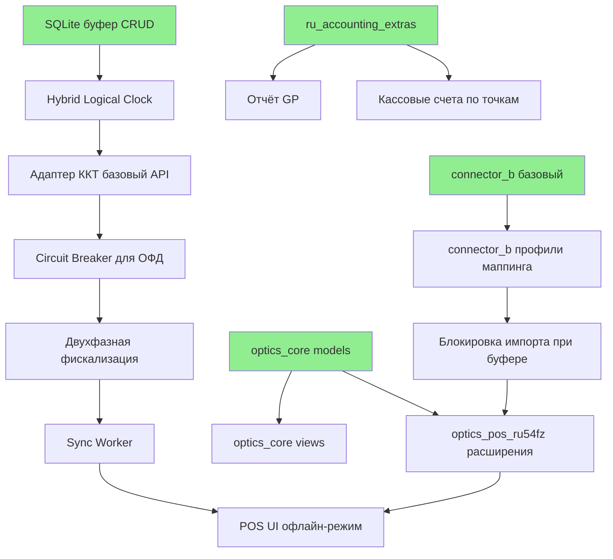

# Инструкции для Claude

## Основные правила работы

### Управление задачами
- **ВАЖНО:** Решать только ОДНУ задачу за запрос
- Если задача требует нескольких шагов, разбить на подзадачи и решать последовательно
- После завершения задачи запросить подтверждение перед началом следующей

### Языковые правила
- Использовать английский язык для комментариев в коде
- Использовать английский язык для документации API
- Использовать русский язык для остальной документации и ответов

### Документация
- **КРИТИЧНО:** Записывать и хранить ЛЮБУЮ документацию ИСКЛЮЧИТЕЛЬНО в `/docs`
- Добавлять диаграммы для сложных концепций
- Запрещено хранить документацию в корне проекта или других каталогах

### Git Workflow (обязательный процесс)

#### Перед началом работы над задачей:
1. Создать отдельную ветку под задачу:
   ```bash
   git checkout -b feature/task-name
   # Например: feature/week1-buffer-crud
   ```

#### Планирование перед кодированием:
2. Создать файл с планом задачи в `/docs/task_plans/`:
   ```bash
   docs/task_plans/YYYYMMDD_task_name.md
   # Например: docs/task_plans/20251008_week1_buffer_crud.md
   ```
3. План должен содержать:
   - Описание задачи
   - Шаги выполнения (детально)
   - Список файлов для создания/изменения
   - Acceptance criteria
   - Команды для тестирования

#### После завершения задачи:
4. Сделать commit с описательным сообщением:
   ```bash
   git add .
   git commit -m "feat: краткое описание задачи

   Подробное описание изменений

   🤖 Generated with Claude Code

   Co-Authored-By: Claude <noreply@anthropic.com>"
   ```

5. Push в remote:
   ```bash
   git push -u origin feature/task-name
   ```

6. Создать Pull Request:
   ```bash
   gh pr create --title "feat: название задачи" --body "$(cat <<'EOF'
   ## Summary
   - Описание изменений

   ## Test plan
   - [ ] Команды для проверки

   🤖 Generated with Claude Code
   EOF
   )"
   ```

## При каждом compact чата:
- Всегда хранить саммари истории чата и действий
- Записывать саммари в `/claude_history`

## При каждом создании/изменении файла:
- Добавлять заголовок с автором, датой обновления и назначением файла
- Использовать Prettify для форматирования

## Логирование тестов (ОБЯЗАТЕЛЬНО)

### Правила сохранения логов тестов:
- **КРИТИЧНО:** ВСЕГДА сохранять логи выполнения тестов в `/tests/logs/`
- Логи сохраняются для КАЖДОГО запуска тестов (unit, integration, smoke, POC, UAT)
- Логи необходимы для отладки, воспроизведения проблем и аудита

### Структура директории логов:
```
tests/
├── logs/
│   ├── unit/
│   │   ├── 20251008_OPTERP-3_hlc_tests.log
│   │   └── 20251008_OPTERP-5_buffer_tests.log
│   ├── integration/
│   ├── smoke/
│   ├── poc/
│   └── uat/
```

### Формат имени файла лога:
```
tests/logs/{test_type}/YYYYMMDD_{TASK_ID}_{description}.log
```

**Примеры:**
- `tests/logs/unit/20251008_OPTERP-3_hlc_tests.log`
- `tests/logs/unit/20251008_OPTERP-5_buffer_crud_tests.log`
- `tests/logs/smoke/20251008_buffer_smoke_test.log`
- `tests/logs/poc/20251015_POC-4_offline_8h_sync.log`

### Команды для сохранения логов:

**Unit tests:**
```bash
# Создать директорию если не существует
mkdir -p tests/logs/unit

# Запустить тесты с сохранением лога
pytest tests/unit/test_hlc.py -v --tb=short 2>&1 | tee tests/logs/unit/$(date +%Y%m%d)_OPTERP-3_hlc_tests.log

# С coverage
pytest tests/unit/test_buffer.py -v --cov=kkt_adapter.app.buffer --cov-report=term-missing 2>&1 | tee tests/logs/unit/$(date +%Y%m%d)_OPTERP-5_buffer_tests.log
```

**Integration tests:**
```bash
mkdir -p tests/logs/integration
pytest tests/integration/ -v 2>&1 | tee tests/logs/integration/$(date +%Y%m%d)_integration_tests.log
```

**Smoke tests:**
```bash
mkdir -p tests/logs/smoke
python test_buffer_smoke.py 2>&1 | tee tests/logs/smoke/$(date +%Y%m%d)_buffer_smoke.log
```

### Содержание лога должно включать:

1. **Заголовок:**
   - Дата и время запуска
   - Task ID (JIRA)
   - Тип тестов (unit/integration/smoke/etc)
   - Окружение (Python version, OS, dependencies)

2. **Вывод pytest/тестов:**
   - Полный вывод с `-v` (verbose)
   - Traceback для failed tests
   - Coverage report (если применимо)

3. **Итоговая статистика:**
   - Количество тестов (passed/failed/skipped)
   - Coverage percentage
   - Время выполнения

### Пример структуры лога:

```
=== Test Log ===
Date: 2025-10-08 15:30:00
Task: OPTERP-3 (Create HLC Unit Tests)
Type: Unit Tests
File: tests/unit/test_hlc.py
Python: 3.11.7
OS: Windows 11

Command:
pytest tests/unit/test_hlc.py -v --cov=kkt_adapter.app.hlc

Output:
============================= test session starts =============================
platform win32 -- Python 3.11.7, pytest-8.1.1, pluggy-1.4.0
...
[полный вывод pytest]
...

Coverage:
Name                     Stmts   Miss  Cover   Missing
------------------------------------------------------
kkt_adapter/app/hlc.py      57      1    98%   175
------------------------------------------------------

Summary:
✅ 26 tests passed
✅ 0 tests failed
✅ Coverage: 98%
✅ Duration: 1.29s

Result: SUCCESS
```

### Когда сохранять логи:

| Событие | Действие |
|---------|----------|
| **Запуск unit tests** | ВСЕГДА сохранять лог в `tests/logs/unit/` |
| **Запуск integration tests** | ВСЕГДА сохранять лог в `tests/logs/integration/` |
| **Smoke test** | ВСЕГДА сохранять лог в `tests/logs/smoke/` |
| **POC тесты (POC-1 до POC-5)** | ВСЕГДА сохранять лог в `tests/logs/poc/` |
| **UAT тесты** | ВСЕГДА сохранять лог в `tests/logs/uat/` |
| **Load tests** | ВСЕГДА сохранять лог в `tests/logs/load/` |
| **Failed test** | Дополнительно создать `{taskid}_FAILED.log` с полным traceback |

### Обработка failed tests:

**Если тест упал (FAILED):**
1. Сохранить лог с суффиксом `_FAILED.log`
2. Сохранить полный traceback
3. Записать в `claude_history/` описание проблемы
4. НЕ делать commit до исправления

**Пример:**
```bash
# Тест упал
pytest tests/unit/test_buffer.py -v 2>&1 | tee tests/logs/unit/20251008_OPTERP-5_buffer_tests_FAILED.log

# Записать в историю
cat >> claude_history/session_20251008.md << EOF

## Test Failure: OPTERP-5
- Test: test_buffer_capacity_check
- Error: AssertionError: Expected BufferFullError
- File: tests/unit/test_buffer.py:123
- Action: Fix capacity check logic in buffer.py:215
EOF
```

### Автоматизация логирования:

**Добавить в Makefile:**
```makefile
# Run unit tests with logging
test-unit:
	@mkdir -p tests/logs/unit
	pytest tests/unit/ -v --cov --cov-report=term-missing 2>&1 | tee tests/logs/unit/$$(date +%Y%m%d)_unit_tests.log

# Run all tests with logging
test-all:
	@mkdir -p tests/logs/{unit,integration,smoke}
	pytest tests/ -v --cov --cov-report=term-missing 2>&1 | tee tests/logs/$$(date +%Y%m%d)_all_tests.log
```

### Git и логи:

**Добавить в .gitignore:**
```
# Test logs (keep structure, ignore content)
tests/logs/**/*.log
!tests/logs/**/.gitkeep
```

**Создать .gitkeep файлы:**
```bash
mkdir -p tests/logs/{unit,integration,smoke,poc,uat,load}
touch tests/logs/{unit,integration,smoke,poc,uat,load}/.gitkeep
```

### Checklist перед commit:

- [ ] Все тесты пройдены (0 FAILED)
- [ ] Логи сохранены в `tests/logs/{test_type}/`
- [ ] Coverage ≥95% (для unit tests)
- [ ] Нет FAILED логов в `tests/logs/`
- [ ] Session history обновлена (если были проблемы)

**ВАЖНО:** Логи тестов — это часть документации разработки. Они помогают:
1. Воспроизвести проблемы
2. Отследить регрессии
3. Провести аудит качества
4. Восстановить контекст после перерывов

# CLAUDE.md — План имплементации OpticsERP (Offline-First POS)

> **Назначение:** Единый план для разработки системы на базе Odoo Community 17 с поддержкой offline-first архитектуры для сети оптик.
> **Версия:** 1.0 • Дата: 2025-10-08 • Разработчик: 1 человек
> **Базовые документы:** docs/1-5 (Постановка задачи, Требования, Архитектура, Дорожная карта, Offline-режим)

---

## 🤖 AI Agent Quick Start

**IMPORTANT:** Read this section first before writing any code.

### Bootstrap Project (First Time Setup)

```bash
# Clone and navigate to project
cd OpticsERP

# Bootstrap: create structure, install dependencies, init database
make bootstrap

# Verify environment (Python 3.11+, Docker, SQLite, Git)
make verify-env

# Run smoke test (verify bootstrap worked)
make smoke-test
```

**Expected output:**
```
✅ Bootstrap complete!
✅ Environment verification complete
✅ Smoke test passed. Ready to develop.
```

### Essential Resources

**Before coding, familiarize yourself with:**

1. **GLOSSARY.md** — Domain terminology (ККТ, ОФД, ФН, Circuit Breaker, etc.)
2. **docs/5. Руководство по офлайн-режиму.md** — Offline architecture (§5.2-5.6)
3. **docs/PROMPT_ENGINEERING_TEMPLATES.md** — Reusable prompts for common tasks
4. **bootstrap/kkt_adapter_skeleton/schema.sql** — SQLite buffer schema

### Your First Task

**Task:** Implement SQLite buffer database CRUD operations

**Steps:**
1. Read `bootstrap/kkt_adapter_skeleton/schema.sql` (understand schema)
2. Implement `kkt_adapter/app/buffer.py` with functions:
   - `insert_receipt(receipt_data)` → receipt_id
   - `get_pending_receipts(limit=50)` → List[Receipt]
   - `mark_synced(receipt_id, server_time)` → bool
   - `move_to_dlq(receipt_id, reason)` → bool
3. Write unit tests in `tests/unit/test_buffer_db.py`

**Checkpoint W1.1:** Run `pytest tests/unit/test_buffer_db.py` — all 5 tests should PASS.

**Reference:** See docs/PROMPT_ENGINEERING_TEMPLATES.md §3.2 for SQLite CRUD template.

---

## 0. Dependency Graph

**Purpose:** Understand task dependencies to parallelize independent work.



**Legend:**
- 🟢 Green nodes: **INDEPENDENT** — can start immediately
- Arrows: Dependencies (A → B means "B depends on A")

**Task Annotations:**

| Task | Status | Dependencies |
|------|--------|-------------|
| SQLite буфер CRUD | INDEPENDENT | None — start immediately |
| Hybrid Logical Clock | INDEPENDENT | None — start immediately |
| optics_core models | INDEPENDENT | None — start immediately |
| connector_b базовый | INDEPENDENT | None — start immediately |
| ru_accounting_extras | INDEPENDENT | None — start immediately |
| Адаптер ККТ базовый API | DEPENDS ON | SQLite буфер, HLC |
| Circuit Breaker | DEPENDS ON | Адаптер ККТ API |
| Двухфазная фискализация | DEPENDS ON | Circuit Breaker |
| Sync Worker | DEPENDS ON | Двухфазная фискализация |
| optics_pos_ru54fz | DEPENDS ON | optics_core, Адаптер ККТ |
| Блокировка импорта | DEPENDS ON | connector_b, Адаптер ККТ buffer API |
| POS UI офлайн | DEPENDS ON | optics_pos_ru54fz, Sync Worker |

**Parallelization Strategy:**
- **Week 1-2 (POC):** Work on SQLite + HLC + optics_core in parallel
- **Week 3-4:** After SQLite done → start Адаптер ККТ; optics_core done → start views
- **Week 6-7 (MVP):** All Odoo modules can be developed in parallel (independent)

---

## 1. Обзор проекта

### 1.1 Цель
Разработать ERP/POS систему для сети оптик на базе Odoo Community 17 с критичной поддержкой **offline-first режима**:
- Автономная работа кассы при обрывах связи с ОФД (8+ часов)
- Бизнес-доступность ≥99.5% (независимо от интернета)
- Соответствие 54-ФЗ с гарантированной фискализацией
- Масштабирование до 20 точек (40 касс)

### 1.2 Ключевые принципы архитектуры
1. **Offline-first:** касса работает автономно, облако вторично
2. **Двухфазная фискализация:** печать локально → отправка в ОФД асинхронно
3. **Гарантированная доставка:** 100% чеков попадают в ОФД (Circuit Breaker + ретраи)
4. **Hybrid Logical Clock:** временные метки не зависят от NTP
5. **Graceful degradation:** плавная деградация без резких отказов
6. **Архитектурные паттерны:** Circuit Breaker, Saga, Bulkhead, Event Sourcing

### 1.3 Технологический стек

**Backend:**
- Odoo Community 17 (Python 3.11+)
- PostgreSQL 15
- Redis (очереди Celery)
- Celery (фоновые задачи)

**Edge (кассовый терминал):**
- FastAPI (адаптер ККТ)
- SQLite (офлайн-буфер, WAL mode)
- APScheduler (heartbeat, синхронизация)

**Мониторинг:**
- Prometheus + Grafana
- Jaeger (трейсинг)
- Sentry (опционально)

**Инфраструктура:**
- Docker + Docker Compose
- Nginx (reverse proxy, TLS 1.3)
- NTP (синхронизация времени)

---

## 2. Этапы разработки (T0 = 06.10.2025)

| Этап | Сроки | Критерии выхода | Фокус |
|------|-------|-----------------|-------|
| **POC** | 06.10 - 09.11 (5 нед) | POC-4/5 пройдены, метрики достигнуты | Proof of concept офлайн-режима |
| **MVP** | 10.11 - 07.12 (4 нед) | UAT ≥95%, офлайн-UAT 100%, 0 блокеров | Полная функциональность |
| **Buffer** | 08.12 - 14.12 (1 нед) | Нагрузочные тесты, 0 блокеров | Стабилизация |
| **Пилот** | 15.12 - 11.01 (4 нед) | Бизнес-доступность ≥99.5%, обучение | 2 точки (4 кассы) |
| **Soft Launch** | 12.01 - 25.01 (2 нед) | Capacity metrics, узкие места | 5 точек (10 касс) |
| **Прод** | 26.01 - 22.02 (4 нед) | RTO≤1ч, RPO≤24ч, 20 точек | Полное развёртывание |

**Итого:** 19 недель (T0 → T0+19)

---

## 3. Архитектура компонентов

### 3.1 Структура проекта

```
OpticsERP/
├── addons/                      # Odoo модули
│   ├── optics_core/             # Рецепты, линзы, заказы на изготовление
│   ├── optics_pos_ru54fz/       # POS + 54-ФЗ + офлайн-режим
│   ├── connector_b/             # Импорт Excel/CSV
│   └── ru_accounting_extras/    # Кассовые счета, отчёт GP
│
├── kkt_adapter/                 # Адаптер ККТ (автономный сервис)
│   ├── app/
│   │   ├── main.py              # FastAPI
│   │   ├── buffer.py            # SQLite буфер + CRUD
│   │   ├── kkt_driver.py        # Драйвер ККТ
│   │   ├── ofd_client.py        # ОФД API + Circuit Breaker
│   │   ├── sync_worker.py       # Фоновая синхронизация
│   │   ├── heartbeat.py         # Heartbeat к Odoo (30s)
│   │   └── hlc.py               # Hybrid Logical Clock
│   ├── data/
│   │   ├── buffer.db            # SQLite офлайн-буфер
│   │   └── cache.json           # Локальный кэш каталога
│   ├── config.toml              # Конфигурация
│   ├── Dockerfile
│   └── docker-compose.yml
│
├── tests/
│   ├── poc/                     # POC-тесты (1-5)
│   ├── uat/                     # UAT-тесты (01-11)
│   ├── load/                    # Нагрузочные тесты (сценарии 1-4)
│   └── integration/             # Интеграционные тесты
│
├── docs/                        # Документация (5 файлов)
├── docker-compose.yml           # Полный стек
├── config.toml                  # Конфигурация проекта
└── CLAUDE.md                    # Этот файл
```

### 3.2 Кастомные модули Odoo

#### optics_core
**Цель:** Доменные сущности оптики

**Модели:**
- `optics.prescription` — рецепт (Sph, Cyl, Axis, PD, Add, Prism)
- `optics.lens` — линза (тип, индекс, покрытие)
- `optics.manufacturing.order` — заказ на изготовление

**Workflow заказа:**
```
Draft → Confirmed → In Production → Ready → Delivered
```

**Файлы:**
- `models/prescription.py`
- `models/lens.py`
- `models/manufacturing_order.py`
- `views/prescription_views.xml`
- `reports/order_label.xml` (штрихкод)

#### optics_pos_ru54fz
**Цель:** POS + 54-ФЗ + офлайн-режим

**Ключевые функции:**
- Интеграция с адаптером ККТ (API вызовы)
- X/Z-отчёты (правильные теги ФФД 1.2)
- Электронный чек (email/SMS)
- UI офлайн-режима (индикация буфера, алерты)

**Новые модели:**
- `pos.offline.buffer.status` — статус буфера для UI
- `pos.session.report` — расширение для X/Z-отчётов

**Файлы:**
- `models/pos_session.py` (расширение)
- `static/src/js/offline_indicator.js` (UI виджет)
- `controllers/kkt_adapter_api.py` (обёртка для вызовов адаптера)

#### connector_b
**Цель:** Импорт прайсов/остатков Excel/CSV

**Функции:**
- Профили маппинга (3+ поставщика)
- Превью импорта с пагинацией
- Upsert (создание/обновление)
- Валидация и отчёт об ошибках
- Блокировка импорта при несинхронизированных буферах

**Модели:**
- `connector.import.profile` — профиль маппинга
- `connector.import.job` — задача импорта
- `connector.import.log` — логи (с пагинацией)

**Файлы:**
- `models/import_profile.py`
- `models/import_job.py`
- `wizards/import_wizard.py` (превью)
- `controllers/import_api.py`

#### ru_accounting_extras
**Цель:** Кассовые счета по точкам, отчёт GP

**Функции:**
- Кассовые счета (`account.account`) по точкам
- Переводы между счетами
- Отчёт валовой прибыли (GP)
- Отчёт прибыли по точкам

**Модели:**
- `account.cash.transfer` — переводы между счетами
- Расширение `sale.order` и `pos.order` для GP

**Файлы:**
- `models/cash_transfer.py`
- `reports/gp_report.py`
- `reports/profit_by_location.py`

---

## 4. Адаптер ККТ (kkt_adapter) — детальная имплементация

### 4.1 Офлайн-буфер (SQLite)

**Схема базы данных:**
```sql
-- Основная таблица чеков
CREATE TABLE receipts (
  id TEXT PRIMARY KEY,              -- UUIDv4
  pos_id TEXT NOT NULL,
  created_at INTEGER NOT NULL,      -- Unix timestamp
  hlc_local_time INTEGER NOT NULL,  -- Hybrid Logical Clock
  hlc_logical_counter INTEGER NOT NULL,
  hlc_server_time INTEGER,          -- Присваивается при синхронизации
  fiscal_doc TEXT NOT NULL,         -- JSON ФФД
  status TEXT NOT NULL DEFAULT 'pending',  -- pending|syncing|synced|failed
  retry_count INTEGER DEFAULT 0,
  last_error TEXT,
  synced_at INTEGER,
  CHECK (status IN ('pending', 'syncing', 'synced', 'failed'))
);

CREATE INDEX idx_status ON receipts(status);
CREATE INDEX idx_created_at ON receipts(created_at);
CREATE INDEX idx_hlc ON receipts(hlc_server_time, hlc_local_time, hlc_logical_counter);

-- Dead Letter Queue
CREATE TABLE dlq (
  id TEXT PRIMARY KEY,
  original_receipt_id TEXT NOT NULL,
  failed_at INTEGER NOT NULL,
  reason TEXT NOT NULL,
  fiscal_doc TEXT NOT NULL,
  retry_attempts INTEGER NOT NULL,
  last_error TEXT,
  resolved_at INTEGER,
  resolved_by TEXT,
  FOREIGN KEY (original_receipt_id) REFERENCES receipts(id)
);

-- События (Event Sourcing)
CREATE TABLE buffer_events (
  id INTEGER PRIMARY KEY AUTOINCREMENT,
  event_type TEXT NOT NULL,
  receipt_id TEXT,
  timestamp INTEGER NOT NULL,
  metadata TEXT,
  CHECK (event_type IN ('receipt_added', 'receipt_synced', 'receipt_failed',
                        'circuit_opened', 'circuit_closed', 'sync_started', 'sync_completed'))
);
```

**Конфигурация SQLite (максимальная durability):**
```python
def init_buffer_db(db_path='/app/data/buffer.db'):
    conn = sqlite3.connect(db_path)

    # КРИТИЧНО: защита от power loss
    conn.execute("PRAGMA journal_mode=WAL")
    conn.execute("PRAGMA synchronous=FULL")       # !!!
    conn.execute("PRAGMA wal_autocheckpoint=100")
    conn.execute("PRAGMA cache_size=-64000")      # 64 MB
    conn.execute("PRAGMA foreign_keys=ON")

    return conn
```

### 4.2 Двухфазная фискализация

**Фаза 1: Локальное сохранение (всегда успешна)**
```python
def create_receipt_phase1(receipt_data):
    """
    Фаза 1: локальная — всегда успешна, даже без сети.
    """
    # 1. Генерация Hybrid Logical Clock timestamp
    hlc = generate_hlc()
    receipt_id = str(uuid.uuid4())

    # 2. Сохранение в SQLite
    buffer_db.execute(
        """INSERT INTO receipts
           (id, pos_id, created_at, hlc_local_time, hlc_logical_counter, fiscal_doc, status)
           VALUES (?, ?, ?, ?, ?, ?, 'pending')""",
        (receipt_id, receipt_data['pos_id'], int(time.time()),
         hlc.local_time, hlc.logical_counter, json.dumps(receipt_data))
    )
    buffer_db.commit()

    # 3. Печать чека на ККТ
    try:
        kkt_driver.print_receipt(receipt_data)
    except TimeoutError:
        send_alert(f"ККТ не отвечает на {receipt_data['pos_id']}", level='P2')

    # 4. Логирование события
    buffer_db.execute(
        "INSERT INTO buffer_events (event_type, receipt_id, timestamp) VALUES (?, ?, ?)",
        ('receipt_added', receipt_id, int(time.time()))
    )

    return receipt_id
```

**Фаза 2: Отправка в ОФД (с Circuit Breaker)**
```python
class OFDCircuitBreaker:
    @circuit(failure_threshold=5, recovery_timeout=60)
    async def send_receipt(self, receipt):
        response = await ofd_client.post("/receipts", json=receipt, timeout=10)
        return response

async def create_receipt_phase2(receipt_id):
    """
    Фаза 2: отправка в ОФД (асинхронная, best-effort)
    """
    receipt = buffer_db.execute(
        "SELECT * FROM receipts WHERE id = ? AND status = 'pending'",
        (receipt_id,)
    ).fetchone()

    if not receipt:
        return

    try:
        if ofd_cb.current_state == "OPEN":
            log.warning(f"Circuit Breaker OPEN, buffering {receipt_id}")
            return

        fiscal_doc = await ofd_cb.send_receipt(json.loads(receipt['fiscal_doc']))

        buffer_db.execute(
            """UPDATE receipts
               SET status='synced', synced_at=?, hlc_server_time=?
               WHERE id=?""",
            (int(time.time()), get_server_time(), receipt_id)
        )
        buffer_db.commit()

    except CircuitBreakerError:
        log.warning(f"Circuit Breaker opened for {receipt_id}")

    except (TimeoutError, ConnectionError) as e:
        buffer_db.execute(
            "UPDATE receipts SET retry_count = retry_count + 1, last_error = ? WHERE id = ?",
            (str(e), receipt_id)
        )
        buffer_db.commit()

        if receipt['retry_count'] + 1 >= 20:
            move_to_dlq(receipt_id, reason="max_retries_exceeded")
```

### 4.3 Hybrid Logical Clock

```python
@dataclass
class HybridTimestamp:
    local_time: int        # Unix timestamp локальной системы
    logical_counter: int   # Монотонный счётчик
    server_time: Optional[int] = None  # Присваивается при синхронизации

    def __lt__(self, other):
        # Порядок: server_time > local_time > logical_counter
        if self.server_time and other.server_time:
            if self.server_time != other.server_time:
                return self.server_time < other.server_time
        elif self.local_time != other.local_time:
            return self.local_time < other.local_time
        return self.logical_counter < other.logical_counter

def generate_hlc():
    """Генерация Hybrid Logical Clock timestamp"""
    global _hlc_counter, _last_hlc_time

    current_time = int(time.time())

    if current_time == _last_hlc_time:
        _hlc_counter += 1
    else:
        _hlc_counter = 0
        _last_hlc_time = current_time

    return HybridTimestamp(
        local_time=current_time,
        logical_counter=_hlc_counter,
        server_time=None
    )
```

### 4.4 API endpoints адаптера

```yaml
# OpenAPI 3.0.3
paths:
  /v1/kkt/receipt:
    post:
      summary: Create fiscal receipt (двухфазная фискализация)
      parameters:
        - name: Idempotency-Key
          in: header
          required: true
          schema: { type: string, format: uuid }
      requestBody:
        content:
          application/json:
            schema:
              type: object
              required: [pos_id, type, items, payments]
              properties:
                pos_id: { type: string }
                type: { enum: [sale, refund, correction] }
                items: { type: array }
                payments: { type: array }
      responses:
        '200':
          description: Чек напечатан и сохранен локально
          content:
            application/json:
              schema:
                properties:
                  status: { enum: [printed, buffered] }
                  receipt_id: { type: string, format: uuid }
                  fiscal_doc: { type: object, nullable: true }
        '503':
          description: Офлайн-буфер переполнен

  /v1/kkt/buffer/status:
    get:
      summary: Статус офлайн-буфера
      responses:
        '200':
          content:
            application/json:
              schema:
                properties:
                  total_capacity: { type: integer, example: 200 }
                  current_queued: { type: integer }
                  percent_full: { type: number }
                  network_status: { enum: [online, offline, degraded] }

  /v1/kkt/buffer/sync:
    post:
      summary: Принудительная синхронизация
      security: [AdminAuth: []]
      requestBody:
        content:
          application/json:
            schema:
              properties:
                force: { type: boolean, default: false }
      responses:
        '202':
          description: Синхронизация запущена
        '409':
          description: Синхронизация уже идет (Distributed Lock)

  /v1/health:
    get:
      summary: Health check
      responses:
        '200':
          content:
            application/json:
              schema:
                properties:
                  status: { enum: [healthy, degraded, unhealthy] }
                  components:
                    type: object
                    properties:
                      circuit_breaker:
                        properties:
                          state: { enum: [CLOSED, OPEN, HALF_OPEN] }
```

---

## 5. План спринтов (детально)

### 5.1 Спринт 1-3: POC (5 недель)

**Неделя 1-2: Базовая инфраструктура**
- [ ] Настройка Docker-окружения (Odoo + PostgreSQL + Redis)
- [ ] Базовая структура модулей Odoo (скелеты)
- [ ] Адаптер ККТ: FastAPI skeleton
- [ ] SQLite буфер: схема + CRUD
- [ ] Hybrid Logical Clock: имплементация + unit-тесты

**Неделя 3: Двухфазная фискализация + Circuit Breaker**
- [ ] Фаза 1: сохранение в SQLite + печать
- [ ] Фаза 2: отправка в ОФД (mock)
- [ ] Circuit Breaker: библиотека + интеграция
- [ ] POC-1: эмулятор ККТ + 50 операций

**Неделя 4: Heartbeat + Офлайн-режим**
- [ ] Heartbeat к Odoo (30s, hysteresis)
- [ ] Автоматическое переключение online/offline/degraded
- [ ] Локальный кэш каталога (1000 товаров)
- [ ] POC-4: 8ч офлайн, 50 чеков, синхронизация

**Неделя 5: Импорт + POC-5 (split-brain)**
- [ ] connector_b: базовый импорт Excel
- [ ] POC-2: импорт 10k строк
- [ ] POC-5: тесты split-brain, flapping, конкурентная синхронизация
- [ ] Отчёт POC + Go/No-Go решение

### 5.2 Спринт 4-5: MVP (4 недели)

**Неделя 6-7: Odoo модули**
- [ ] optics_core: модели рецептов/линз/заказов
- [ ] optics_pos_ru54fz: POS UI + X/Z-отчёты
- [ ] ru_accounting_extras: кассовые счета + GP
- [ ] connector_b: профили маппинга + превью

**Неделя 8: Офлайн UI + архитектурные паттерны**
- [ ] UI офлайн-режима: статус-бар, tooltip, алерты
- [ ] Страница "Офлайн-буфер" (администратор)
- [ ] Distributed Lock для синхронизации (Redis)
- [ ] Saga Pattern для возврата чека
- [ ] Bulkhead Pattern (Celery очереди: critical/high/default/low)

**Неделя 9: Тестирование + UAT**
- [ ] UAT-01/02/03/04: позитивные сценарии
- [ ] UAT-08/09/10b/10c/11: офлайн-сценарии
- [ ] Исправление критичных дефектов
- [ ] MVP sign-off

### 5.3 Спринт 6: Buffer (1 неделя)

**Неделя 10: Стабилизация**
- [ ] Нагрузочные тесты (сценарии 1-3)
- [ ] Упрощённый нагрузочный тест (5 касс, сценарий 4)
- [ ] Rollback-процедура: тестирование
- [ ] Документация: обновление всех 5 документов
- [ ] CI/CD gate: автоматизация DoD

### 5.4 Спринт 7-8: Пилот (4 недели)

**Неделя 11-12: Развёртывание 2 точек**
- [ ] Установка адаптеров ККТ на 4 кассы
- [ ] Настройка UPS + graceful shutdown
- [ ] Обучение кассиров (≥90% прохождение теста)
- [ ] Регламент X/Z-отчётов + офлайн-буфер

**Неделя 13-14: Мониторинг + реальная эксплуатация**
- [ ] Grafana dashboard (4 панели)
- [ ] Алерты Prometheus + интеграция (email/telegram)
- [ ] Stress-test: 2 кассы × 8ч офлайн × 50 чеков
- [ ] Decision Tree для L1/L2
- [ ] Процедура замены ФН
- [ ] Пилот sign-off

### 5.5 Спринт 9: Soft Launch (2 недели)

**Неделя 15-16: Масштабирование 5 точек + capacity metrics**
- [ ] Развёртывание 5 дополнительных касс (итого 10)
- [ ] Нагрузочный тест упрощённый (сценарий 4: 5 касс, 1000 чеков/день)
- [ ] Capacity metrics: PostgreSQL, Celery, Odoo
- [ ] Проверка узких мест:
  - [ ] PostgreSQL query P95 <50ms
  - [ ] Celery critical queue <30 задач
  - [ ] Нет OOM/CPU throttling
- [ ] Процедура добавления кассы (задокументирована + тест)
- [ ] Оптимизация по результатам
- [ ] Soft Launch sign-off

### 5.6 Спринт 10-11: Продуктив (4 недели)

**Неделя 17-18: Развёртывание 20 точек**
- [ ] Масштабирование на 20 точек (40 касс)
- [ ] pgbouncer: настройка (если нужно)
- [ ] Бэкапы офлайн-буферов: ежедневные snapshot
- [ ] DR-тестирование: RTO≤1ч, RPO≤24ч

**Неделя 19-20: Документация + Day 2 Ops**
- [ ] Руководство администратора (≥50 страниц)
- [ ] Runbook (≥20 сценариев)
- [ ] SLA инцидентов + процедуры эскалации
- [ ] On-call процедура
- [ ] Регламенты поддержки
- [ ] Продуктив sign-off

---

## 6. Критерии приёмки этапов (DoD)

### 6.1 MVP Exit

| Критерий | Процедура верификации | Автоматизация |
|----------|----------------------|---------------|
| **≥95% UAT пройдено** | Протокол UAT (11 сценариев) | Частично (автотесты) |
| **0 блокирующих дефектов** | JIRA: `type=Bug AND severity=Blocker AND status!=Closed` | Полностью (CI gate) |
| **Дубликаты чеков = 0** | SQL-запрос по буферу + ОФД API | Полностью (pytest) |
| **P95 печати ≤7с** | Jaeger traces за 24ч | Полностью (Jaeger API) |
| **Импорт 10k ≤2 мин** | Тестовый импорт | Полностью (pytest) |
| **Офлайн: 8ч, 50 чеков, синхронизация ≤10 мин** | Автотест POC-4 | Полностью (pytest + tc qdisc) |
| **UAT-08/09/10b/10c/11 пройдены** | Ручные офлайн-UAT | Частично (backend автотесты) |
| **Circuit Breaker работает** | Эмуляция 5 ошибок ОФД → OPEN → HALF_OPEN | Автотест (pytest) |
| **Distributed Lock работает** | Конкурентная синхронизация → HTTP 409 | Автотест (pytest) |
| **Saga Pattern работает** | Возврат несинхронизированного чека → HTTP 409 | Автотест (pytest) |

### 6.2 Пилот Exit

- ✅ Все критерии MVP
- ✅ Бизнес-доступность ≥99.5% (2 недели)
- ✅ Обучение кассиров: ≥90% прошли тест
- ✅ Регламенты X/Z + офлайн утверждены
- ✅ Stress-test: 2 кассы × 8ч × 50 чеков → 100% синхронизация
- ✅ 0 P1 инцидентов за 2 недели

### 6.3 Продуктив Exit

- ✅ Все критерии Пилота
- ✅ Масштабирование: 20 точек (40 касс)
- ✅ RTO≤1ч, RPO≤24ч (проверено)
- ✅ Мониторинг: дашборд + алерты активны
- ✅ Бэкапы: PostgreSQL + SQLite ежедневно
- ✅ Регламенты поддержки утверждены

---

## 7. Риски и митигация

| Риск | Вероятность | Влияние | Митигация |
|------|-------------|---------|-----------|
| **Переполнение офлайн-буфера** | Средняя | Критичное | Алерт при 80%, блокировка при 100%, процедура экстренной синхронизации |
| **Рассинхронизация времени ККТ** | Низкая | Высокое | NTP обязателен, Hybrid Clock снижает зависимость, мониторинг drift |
| **ФН заполнен во время офлайна** | Низкая | Критичное | Алерт за 3-5 дней, процедура замены ФН с синхронизацией буфера |
| **Ограниченные ресурсы (1 разработчик)** | Высокая | Среднее | Фокус на MVP, автоматизация тестов, part-time DevOps/QA |
| **Недостоверные прайсы поставщиков** | Высокая | Среднее | Валидация, превью импорта, алерты на расхождения >20% |

---

## 8. Мониторинг и метрики

### 8.1 Ключевые метрики Prometheus

```python
# Офлайн-буфер
kkt_buffer_size = Gauge('kkt_buffer_size', 'Current buffer size', ['pos_id'])
kkt_buffer_percent_full = Gauge('kkt_buffer_percent_full', 'Buffer fullness %', ['pos_id'])

# Circuit Breaker
kkt_circuit_breaker_state = Gauge('kkt_circuit_breaker_state', 'State: 0=CLOSED, 1=OPEN, 2=HALF_OPEN', ['pos_id'])
kkt_circuit_breaker_opens = Counter('kkt_circuit_breaker_opens_total', 'Times opened', ['pos_id'])

# Синхронизация
kkt_sync_duration_seconds = Histogram('kkt_sync_duration_seconds', 'Sync duration', ['pos_id'])
kkt_receipts_synced = Counter('kkt_receipts_synced_total', 'Total synced', ['pos_id', 'status'])

# DLQ
kkt_dlq_size = Gauge('kkt_dlq_size', 'Dead Letter Queue size', ['pos_id'])

# Hybrid Clock
kkt_hlc_drift_seconds = Gauge('kkt_hlc_drift_seconds', 'HLC drift from NTP', ['pos_id'])
```

### 8.2 Алерты (критичные)

```yaml
groups:
  - name: offline_mode_alerts
    rules:
      - alert: OfflineBufferWarning
        expr: kkt_buffer_percent_full >= 80
        for: 5m
        labels: { severity: P2 }
        annotations:
          summary: "Офлайн-буфер ≥80% на {{ $labels.pos_id }}"

      - alert: OfflineBufferFull
        expr: kkt_buffer_percent_full >= 100
        for: 1m
        labels: { severity: P1 }
        annotations:
          summary: "Офлайн-буфер переполнен на {{ $labels.pos_id }}"

      - alert: CircuitBreakerOpen
        expr: kkt_circuit_breaker_state == 1
        for: 5m
        labels: { severity: P2 }
        annotations:
          summary: "Circuit Breaker OPEN на {{ $labels.pos_id }}"
```

### 8.3 Grafana Dashboard (4 панели)

1. **Статус касс:** карта с цветовой индикацией (🟢/🟡/🔴)
2. **Circuit Breaker:** состояния за 24ч (CLOSED/OPEN/HALF_OPEN)
3. **Офлайн-буфер:** заполненность, топ-5 касс, средняя синхронизация
4. **Производительность:** P95 печати, throughput синхронизации, DLQ

---

## 9. Чек-лист готовности перед развёртыванием

### 9.1 Pre-flight (перед каждым развёртыванием)

**Инфраструктура:**
- [ ] Офлайн-буфер пуст (<10 чеков на всех кассах)
- [ ] NTP-синхронизация активна (drift <1с)
- [ ] Кэш каталога актуален (<1ч давности)
- [ ] Свободное место на диске ≥10GB
- [ ] Heartbeat к Odoo работает (100% касс)

**Функционал:**
- [ ] Тестовая продажа в онлайн-режиме успешна (все кассы)
- [ ] Тестовая продажа в офлайн-режиме успешна (минимум 1 касса)
- [ ] Алерты срабатывают корректно (тест на стенде)

**Мониторинг:**
- [ ] Grafana дашборд доступен и актуален
- [ ] Prometheus exporter работает на всех адаптерах
- [ ] Интеграция с каналами алертов работает

### 9.2 Post-deployment (smoke-test)

**В течение 30 минут:**
- [ ] Продажа на каждой кассе (100% успех)
- [ ] Проверка офлайн-буферов (размер не вырос)
- [ ] Heartbeat восстановлен (все кассы)
- [ ] Мониторинг: нет критичных алертов

**В течение 24 часов:**
- [ ] Нет P1/P2 инцидентов
- [ ] Офлайн-буферы стабильны
- [ ] Логи: нет критичных ошибок

---

## 10. Регламенты эксплуатации

### 10.1 Бэкапы

**PostgreSQL:**
- Ежедневный full backup (pg_dump)
- Инкрементальные каждые 6 часов
- Ретенция: 90 дней

**SQLite буферы:**
- Ежедневный snapshot всех SQLite-файлов
- Ретенция: 7 дней
- `PRAGMA wal_checkpoint(TRUNCATE)` перед backup

### 10.2 SLA инцидентов

| Приоритет | Response | Resolution | Эскалация |
|-----------|----------|------------|-----------|
| P1 (Critical) | ≤15 мин | ≤1 ч | Владелец через 30 мин |
| P2 (High) | ≤1 ч | ≤4 ч | Тех. лидер через 2ч |
| P3 (Medium) | ≤24 ч | ≤3 дня | Нет |

### 10.3 On-call

**Контакты:**
- L1: __________________ (телефон, telegram)
- L2: __________________ (телефон, telegram)
- Владелец: __________________ (только P1)

**Ротация:** недельная (пн 09:00 → пн 09:00)

---

## 11. Следующие шаги

### Немедленно (Неделя 1):
1. Настроить Docker-окружение (docker-compose.yml)
2. Создать скелеты модулей Odoo
3. Начать разработку адаптера ККТ (FastAPI)
4. Реализовать SQLite буфер с базовой схемой

### Короткий срок (Неделя 2-3):
1. Имплементировать Hybrid Logical Clock
2. Разработать Circuit Breaker для ОФД
3. Создать POC-тесты (1-5)

### Средний срок (Неделя 4-9):
1. Завершить MVP (все модули + UAT)
2. Провести нагрузочные тесты
3. Подготовить к пилоту

---

## 12. Дополнительные ресурсы

**Документация:**
- docs/1. Постановка задачи.md — цели, OKR, стратегия
- docs/2. Требования.md — функциональные/нефункциональные требования, UAT
- docs/3. Архитектура.md — компоненты, API, развёртывание
- docs/4. Дорожная карта.md — план работ, артефакты
- docs/5. Руководство по офлайн-режиму.md — архитектура офлайн, Decision Tree, процедуры

**Внешние спецификации:**
- 54-ФЗ: фискализация и отчётность
- ФФД 1.2: формат фискальных данных
- Odoo 17 Community: документация

**Инструменты:**
- Circuit Breaker: библиотека `pybreaker`
- Distributed Lock: Redis + `python-redis-lock`
- Hybrid Clock: custom имплементация
- OpenTelemetry: трейсинг

---

## Заключение

Этот план имплементации OpticsERP фокусируется на **offline-first архитектуре** как критичном требовании. Ключевые моменты:

✅ **Двухфазная фискализация** гарантирует бизнес-непрерывность
✅ **Circuit Breaker** защищает от каскадных отказов
✅ **Hybrid Logical Clock** обеспечивает корректный порядок событий
✅ **Distributed Lock** предотвращает конкурентные конфликты
✅ **19 недель** от старта до продуктива (T0 → T0+19)
✅ **Пошаговый план** с чёткими критериями успеха

**Следующий шаг:** начать Спринт 1 (POC) с настройки инфраструктуры.

---

## 13. AI Agent Handoff Protocol

### 13.1 When Starting New AI Session

**Purpose:** Resume development from last checkpoint without loss of context.

**Steps:**

1. **Resume from checkpoint history:**
   ```bash
   # Read last session notes
   cat claude_history/session_$(date +%Y%m%d).md

   # Or find latest session
   ls -t claude_history/ | head -1
   ```

2. **Verify environment:**
   ```bash
   # Check project structure
   make verify-env

   # Check git status (what was changed?)
   git status

   # List all tests (should be 50+ after POC)
   pytest --co
   ```

3. **Run last checkpoint:**
   ```bash
   # Example: resuming after W6.2 (optics.lens model)
   pytest tests/unit/test_lens.py -v

   # Expected: All tests PASS
   ```

4. **If checkpoint fails:**
   - **STOP** — do not proceed with development
   - **Escalate to human** with detailed error report:
     ```
     ❌ Checkpoint W6.2 failed

     Test: tests/unit/test_lens.py::test_lens_coating_validation
     Error: AssertionError: Expected coating 'AR' in allowed list

     Last commit: a3f2d1e "feat(optics_core): add lens model"
     Last session: claude_history/session_20251008.md

     Action needed: Review lens.py:45 coating validation logic
     ```

### 13.2 When Ending AI Session

**Purpose:** Document progress for next session (human or AI).

**Steps:**

1. **Document progress:**
   ```bash
   # Create/update session file
   SESSION_FILE="claude_history/session_$(date +%Y%m%d).md"

   cat >> $SESSION_FILE << EOF
   ## Session $(date +%Y-%m-%d\ %H:%M)

   ### Completed
   - ✅ optics.lens model implemented (models/lens.py)
   - ✅ Unit tests written (tests/unit/test_lens.py)
   - ✅ Checkpoint W6.2 passed

   ### Next Session Tasks
   - [ ] Implement optics.manufacturing.order workflow
   - [ ] Run Checkpoint W6.3

   ### Checkpoints Status
   - W6.1 (prescription model): ✅ PASS
   - W6.2 (lens model): ✅ PASS
   - W6.3 (manufacturing order): ⏳ Pending

   ### Blockers
   - None

   ### Notes
   - Lens coating validation required additional enum constraint
   - Added index range check (1.5-1.9) per specs
   EOF
   ```

2. **Commit work:**
   ```bash
   # Stage changes
   git add .

   # Commit with checkpoint reference
   git commit -m "feat(optics_core): implement lens model [W6.2]

   - Add Lens model with type, index, coating fields
   - Validation for coating options and index range
   - Unit tests for all lens types (single/bifocal/progressive)

   Checkpoint: W6.2 ✅"
   ```

3. **Push to remote (if applicable):**
   ```bash
   git push origin main
   ```

### 13.3 Session History Template

**File:** `claude_history/session_YYYYMMDD.md`

```markdown
# Development Session — YYYY-MM-DD

## Session Info
- **Date:** 2025-10-08
- **Duration:** 2 hours
- **Sprint:** POC Week 6
- **AI Agent:** Claude Sonnet 4.5

---

## Completed Tasks

- ✅ Task description
  - File: path/to/file.py
  - Lines changed: +150 -20
  - Tests: tests/unit/test_file.py (5 tests, all PASS)

---

## Checkpoints

| Checkpoint | Status | Details |
|------------|--------|---------|
| W6.1 | ✅ PASS | Prescription model tests pass |
| W6.2 | ✅ PASS | Lens model tests pass |
| W6.3 | ⏳ Next | Manufacturing order (pending) |

---

## Next Session Tasks

1. [ ] Implement optics.manufacturing.order
2. [ ] Run Checkpoint W6.3
3. [ ] Start optics_core views if W6.3 passes

---

## Blockers

- None

---

## Notes & Learnings

- Lens coating enum required CHECK constraint in Odoo
- Index range validation: 1.5-1.9 (common optical indices)
- Progressive lens type needs Add field validation

---

## Git Commits

- `a3f2d1e` feat(optics_core): implement prescription model [W6.1]
- `b4e5f2a` feat(optics_core): implement lens model [W6.2]
```

### 13.4 Error Recovery Protocol

**When checkpoint fails, follow this protocol:**

1. **Analyze failure:**
   ```bash
   # Run with verbose output
   pytest tests/unit/test_prescription.py -vv

   # Check logs
   tail -100 logs/app.log | grep ERROR
   ```

2. **Check if regression:**
   ```bash
   # Run all previously passing tests
   pytest tests/unit/ -k "not prescription"

   # If other tests now fail → ROLLBACK
   git log --oneline -5
   git reset --hard HEAD~1  # Rollback last commit
   ```

3. **Fix root cause:**
   - Edit code (NOT tests) to fix issue
   - Do NOT modify passing tests to make them fail
   - Re-run full test suite (not just failed tests)

4. **Re-run full test suite:**
   ```bash
   pytest tests/unit/ -v

   # All tests should PASS
   ```

5. **If 3 consecutive failures:**
   - **Escalate to human**
   - Create detailed issue report:
     ```markdown
     ## ❌ Checkpoint W6.1 Failed (3 attempts)

     **Test:** tests/unit/test_prescription.py::test_sph_range
     **Error:** AssertionError: -25 not in valid Sph range (-20, +20)

     **Attempts:**
     1. Fixed Sph validation → test_cyl_validation failed
     2. Fixed Cyl validation → test_sph_range failed again
     3. Tried different approach → same error

     **Root Cause Hypothesis:**
     - Sph range validation logic incorrect (models/prescription.py:67)
     - Test data generator creating invalid prescriptions?

     **Action Needed:**
     Human review of Sph validation logic and test fixtures.
     ```

### 13.5 Auto-Rollback Triggers

**Automatically rollback (git reset) if:**

1. **Regression detected:**
   - Previously passing tests now fail
   - Action: `git reset --hard HEAD~1`

2. **Coverage drops >5%:**
   ```bash
   # Before commit
   pytest --cov=kkt_adapter --cov-report=term | grep TOTAL
   # Coverage: 82%

   # After commit
   pytest --cov=kkt_adapter --cov-report=term | grep TOTAL
   # Coverage: 75%  (dropped 7% → ROLLBACK)
   ```

3. **Linter errors increase:**
   ```bash
   # Before: 0 errors
   # After: 15 errors → ROLLBACK
   ```

### 13.6 Code Stability Zones

**Frozen after POC (do NOT refactor without explicit approval):**

- SQLite schema (`bootstrap/kkt_adapter_skeleton/schema.sql`)
- Hybrid Logical Clock implementation (`kkt_adapter/app/hlc.py`)
- Circuit Breaker configuration (`config.toml` §buffer.*)
- FFD 1.2 fiscal document structure

**Refactorable during MVP:**

- API endpoint names (for consistency)
- UI components (офлайн-режим indicators)
- Prometheus metric names (if Grafana needs changes)
- Internal function names (non-public API)

**Rule:** If AI wants to refactor frozen code, create issue + ask human approval first.

### 13.7 Context Preservation Checklist

**Before ending session, ensure:**

- [ ] Session history updated (`claude_history/session_YYYYMMDD.md`)
- [ ] All changes committed with checkpoint reference
- [ ] Last checkpoint passed (verified with pytest)
- [ ] No uncommitted changes (`git status` clean)
- [ ] Next tasks documented clearly
- [ ] Blockers (if any) escalated to human

**Before starting session, ensure:**

- [ ] Read last session history
- [ ] Environment verified (`make verify-env`)
- [ ] Last checkpoint re-run (to verify state)
- [ ] If checkpoint fails → escalate, do NOT proceed

---

## 14. Code Freeze Points & Refactoring Policy

### 14.1 Frozen Components (After POC Sign-Off)

**Components below are FROZEN after POC passes. Do NOT modify without human approval.**

| Component | File(s) | Reason |
|-----------|---------|--------|
| **SQLite Schema** | `bootstrap/kkt_adapter_skeleton/schema.sql` | Migration complexity, data durability |
| **HLC Implementation** | `kkt_adapter/app/hlc.py` | Timestamp ordering critical for conflict resolution |
| **Circuit Breaker Params** | `config.toml` (buffer.*) | Tuned during POC testing |
| **FFD 1.2 Structure** | Fiscal doc JSON schema | 54-ФЗ compliance |
| **Prometheus Metrics** | Metric names/labels | Grafana dashboards depend on them |

**If refactoring needed:**
1. Create GitHub issue with detailed justification
2. Wait for human approval
3. Create migration script (for DB changes)
4. Update all dependent code/tests
5. Run full regression test suite

### 14.2 Refactorable Components (During MVP)

**Safe to refactor without approval:**

- API endpoint paths (update docs)
- Internal function names (non-public API)
- UI component structure
- Variable names (maintain readability)
- Test helper functions

**Best practice:** Still document refactoring in commit message.

---

**🤖 For AI Agents:** This handoff protocol ensures continuity across sessions. Always follow §13.1-13.2 when starting/ending work.
