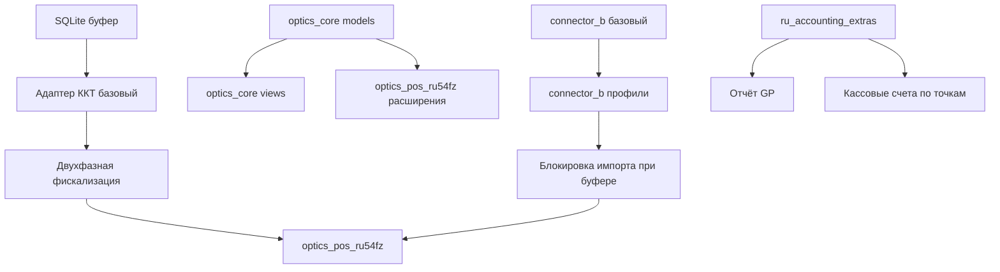
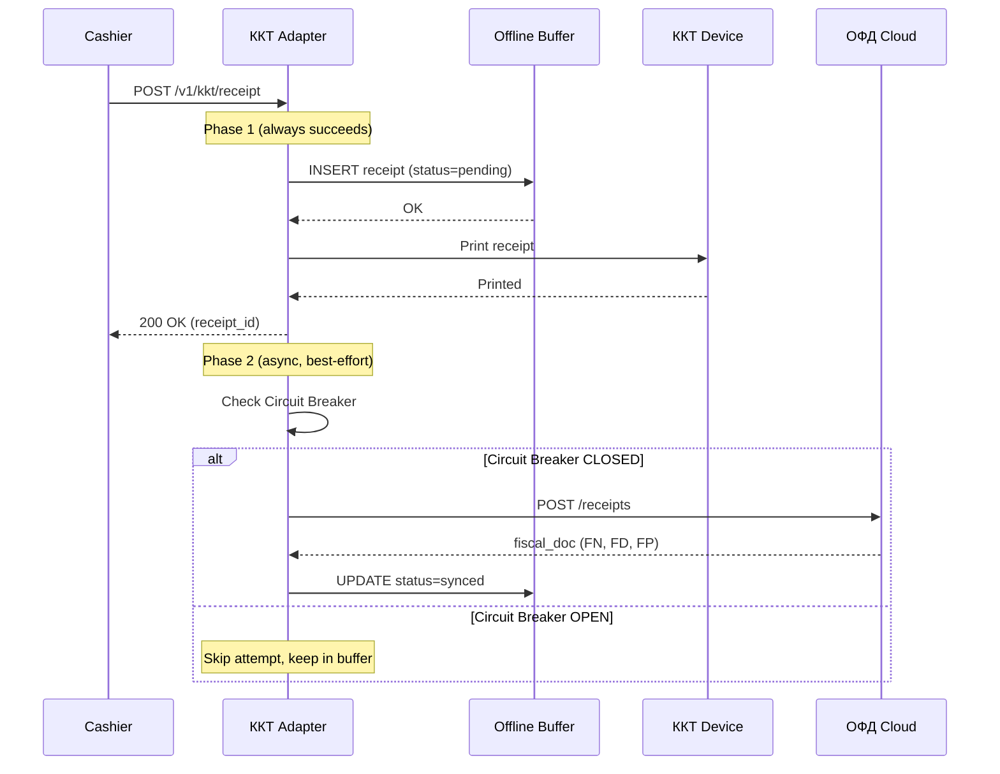

# Critical Analysis — OpticsERP Documentation Review

> **Author:** AI Analysis Agent
> **Date:** 2025-10-08
> **Purpose:** Comprehensive critique of OpticsERP documentation with focus on AI-agent-driven development
> **Scope:** All 5 core documents + CLAUDE.md implementation plan

---

## Executive Summary

The OpticsERP documentation suite is **exceptionally detailed** and demonstrates enterprise-grade planning for an offline-first POS system. However, when viewed through the lens of **AI-agent-driven development** (single developer + AI assistants), several critical gaps and inefficiencies emerge.

**Overall Grade: B+ (Very Good, but can be A+ with adjustments)**

**Key Strengths:**
- ✅ Offline-first architecture is thoroughly designed
- ✅ Clear metrics and acceptance criteria (DoD)
- ✅ Comprehensive risk analysis
- ✅ Detailed API specifications

**Critical Gaps for AI Development:**
- ❌ Missing executable code examples for AI to bootstrap from
- ❌ No test data generators (AI needs concrete fixtures)
- ❌ Insufficient prompt engineering guidance
- ❌ Missing incremental validation checkpoints
- ❌ Unclear prioritization for AI task breakdown

---

## 1. Critical Issues (Must Fix Before Development)

### 1.1 **BLOCKER: No Executable Scaffolding for AI Agents**

**Problem:**
Documentation describes *what* to build but provides minimal *how* for AI agents to start. AI agents excel at **modifying existing code**, not creating complex systems from scratch.

**Impact:** High risk of AI agents producing incompatible implementations across different sessions.

**Evidence:**
- CLAUDE.md has Python pseudocode for Circuit Breaker, but no actual FastAPI project structure
- No SQLite schema initialization script (only SQL in markdown)
- No Odoo module scaffolding (models/views/controllers)

**Recommendation:**
```bash
# Create bootstrap repository
/bootstrap
  ├── kkt_adapter_skeleton/     # FastAPI with SQLite, Circuit Breaker stubs
  ├── odoo_modules_skeleton/    # Empty models/views for 4 modules
  ├── docker-compose.dev.yml    # Working Odoo 17 + PostgreSQL + Redis
  ├── tests/conftest.py         # Pytest fixtures (mock ОФД, SQLite in-memory)
  └── Makefile                  # Commands: init, test, run
```

**AI-Friendly Alternative:**
Add section to CLAUDE.md:
```markdown
## 0. Bootstrap Commands (Run First)

```bash
# Initialize project structure
make bootstrap

# Verify environment
make verify-env

# Run POC-1 smoke test
make test-poc-1
```

This gives AI agents a **concrete starting point** instead of blank files.
```

---

### 1.2 **BLOCKER: Missing Test Data Generators**

**Problem:**
AI agents need **deterministic test data** to validate implementations. Documentation mentions "тестовые датасеты 10k строк" but provides no script to generate them.

**Impact:** AI will create incompatible test data across sessions, breaking reproducibility.

**Evidence:**
- Док. 2 §2.11 describes catalog structure (SKU, EAN, price) but no CSV generator
- POC-2 requires "профиль маппинга для 1 поставщика" — but where is the sample file?
- UAT-03 needs "прайс с конфликтами" — how does AI create this?

**Recommendation:**
Create `tests/fixtures/generate_test_data.py`:

```python
"""
Generate deterministic test datasets for OpticsERP

Usage:
  python generate_test_data.py --catalog 10000 --output catalog.xlsx
  python generate_test_data.py --supplier OptMarket --output supplier_a.csv
"""

import pandas as pd
import random
from faker import Faker

def generate_catalog(size=10000, error_rate=0.03):
    """
    Generate test catalog with controlled errors

    Returns:
      - catalog.xlsx: size rows with error_rate% intentional errors
      - catalog_errors.json: list of injected errors for validation
    """
    # ... (implementation from Док. 2 Appendix A)
```

**Why this matters for AI:**
- AI can **run the script** to get exact test data
- AI can **read the error injection log** to write validation tests
- AI sessions are **reproducible** (same seed → same data)

---

### 1.3 **HIGH: No Incremental Validation Checkpoints**

**Problem:**
19-week plan has only 6 major gates (POC/MVP/Buffer/Pilot/Soft/Prod). AI agents need **daily/weekly checkpoints** to avoid diverging from spec.

**Impact:** AI might spend 2 weeks building wrong thing, discovered only at MVP gate.

**Evidence:**
- Sprint 4-5 (MVP) is 4 weeks with single exit criteria (≥95% UAT)
- No intermediate checkpoints: "Week 6: optics_core models" — how do we validate?
- If AI implements `optics.prescription` wrong in Week 6, discovered in Week 9 (UAT)

**Recommendation:**
Add **micro-gates** to CLAUDE.md Sprint plans:

```markdown
### Sprint 4-5: MVP (4 недели)

**Week 6: optics_core models**
- [ ] optics.prescription model (Day 1-2)
  - **Checkpoint W6.1 (Day 2 EOD):** Run `pytest tests/unit/test_prescription.py`
    - ✅ All prescription fields validate (Sph range -20 to +20)
    - ✅ Prescription model serializes to JSON correctly
- [ ] optics.lens model (Day 3-4)
  - **Checkpoint W6.2 (Day 4 EOD):** Run `pytest tests/unit/test_lens.py`
    - ✅ Lens types (single/bifocal/progressive) validate
    - ✅ Coating options stored correctly
- [ ] optics.manufacturing.order workflow (Day 5)
  - **Checkpoint W6.3 (Day 5 EOD):** Run `pytest tests/integration/test_mo_workflow.py`
    - ✅ State transitions Draft→Confirmed→In Production work
    - ✅ Odoo UI shows workflow buttons

**Week 6 Gate:** All 3 checkpoints ✅ → Proceed to Week 7
```

**AI Benefit:**
- AI can self-validate daily (no waiting for human review)
- Faster feedback loop (2 days vs 4 weeks)
- Human reviews only failed checkpoints

---

### 1.4 **MEDIUM: Unclear Task Decomposition for AI Agents**

**Problem:**
Documentation describes high-level tasks ("Создать optics_core") but AI agents need **atomic, dependency-ordered tasks**.

**Impact:** AI might build components in wrong order (e.g., views before models).

**Evidence:**
- "Неделя 6-7: Odoo модули" lists 4 modules but no dependency graph
- Does `connector_b` depend on `optics_core`? (Answer: no, but not explicit)
- Can AI work on `ru_accounting_extras` in parallel with `optics_pos_ru54fz`? (Answer: yes, but not clear)

**Recommendation:**
Add **dependency graph** to CLAUDE.md:



**AI-Friendly Alternative:**
In CLAUDE.md, annotate tasks with dependencies:

```markdown
- [ ] optics_core models (INDEPENDENT, can start immediately)
- [ ] connector_b базовый (INDEPENDENT, can start immediately)
- [ ] optics_pos_ru54fz (DEPENDS ON: Адаптер ККТ, optics_core)
- [ ] Блокировка импорта (DEPENDS ON: connector_b, Адаптер ККТ buffer API)
```

This allows AI (or orchestrator) to **parallelize independent tasks**.

---

## 2. Major Issues (High Impact, Should Fix)

### 2.1 **Missing Prompt Engineering Templates**

**Problem:**
AI agents need **context-aware prompts** for each task. Documentation assumes human developer intuition.

**Example:**
Task: "Implement Circuit Breaker for ОФД"

**Current (implicit):**
AI gets raw task → hallucinates implementation → might use wrong pattern.

**Recommended (explicit prompt template):**

```markdown
## Prompt Template: Implement Circuit Breaker for ОФД

**Context:**
- You are implementing ОФД API client with Circuit Breaker pattern
- Location: kkt_adapter/app/ofd_client.py
- Dependencies: pybreaker library (already in requirements.txt)

**Constraints:**
- Use pybreaker.CircuitBreaker with these parameters:
  - failure_threshold=5 (from config.toml §buffer.circuit_breaker_threshold)
  - recovery_timeout=60 (from Док. 3 §3.6.1)
  - expected_exception=(TimeoutError, ConnectionError, HTTPError)
- Circuit Breaker state must be exposed via /v1/health endpoint
- Prometheus metric: kkt_circuit_breaker_state (0=CLOSED, 1=OPEN, 2=HALF_OPEN)

**Reference Implementations:**
- See Док. 5 §5.4 for pseudocode
- See tests/poc/test_poc_5_splitbrain.py for expected behavior

**Acceptance Criteria:**
- [ ] 5 consecutive ОФД errors → Circuit Breaker OPEN
- [ ] OPEN state lasts 60s, then transitions to HALF_OPEN
- [ ] Successful probe request in HALF_OPEN → CLOSED
- [ ] Metric kkt_circuit_breaker_state updates correctly
- [ ] Test: pytest tests/unit/test_circuit_breaker.py passes

**Output:**
- File: kkt_adapter/app/ofd_client.py (full implementation)
- Test: tests/unit/test_circuit_breaker.py (if not exists)
```

**Why this matters:**
AI agents get **all context in one prompt** → no back-and-forth clarifications → faster implementation.

---

### 2.2 **No Versioning Strategy for AI-Generated Code**

**Problem:**
AI agents might refactor working code during later tasks. Documentation lacks **code freeze points**.

**Impact:** Working POC-4 implementation might break during MVP refactoring.

**Evidence:**
- After POC-4 passes (офлайн-буфер works), AI might refactor SQLite schema during MVP
- No guidance: "preserve POC implementations" vs "refactor for production"

**Recommendation:**
Add to CLAUDE.md:

```markdown
## Code Stability Zones

**Frozen after POC (do not refactor without explicit approval):**
- SQLite schema (buffer.db structure)
- Hybrid Logical Clock implementation (hlc.py)
- Circuit Breaker configuration (failure_threshold, recovery_timeout)

**Refactorable during MVP:**
- API endpoint names (if needed for consistency)
- UI components (офлайн-режим indicators)
- Prometheus metric names (if Grafana dashboard needs change)

**Rule:** If AI wants to refactor frozen code, create issue + ask human approval first.
```

---

### 2.3 **Insufficient Error Recovery Procedures for AI**

**Problem:**
When AI agent fails a checkpoint, what should it do? Documentation has human-focused procedures but no AI self-recovery.

**Example:**
Checkpoint W6.1 fails: `pytest tests/unit/test_prescription.py` → 3 tests fail

**Current (implicit):**
AI fixes tests → re-runs → might introduce new bugs

**Recommended (explicit recovery protocol):**

```markdown
## AI Agent Error Recovery Protocol

**When checkpoint fails:**

1. **Analyze failure** (run pytest with -vv for detailed output)
2. **Check if regression** (did previously passing tests now fail?)
   - If yes: ROLLBACK to last checkpoint commit
   - If no: Proceed to step 3
3. **Fix root cause** (edit code, not tests)
4. **Re-run full test suite** (not just failed tests)
5. **If 3 consecutive failures:** Escalate to human (create detailed issue)

**Auto-rollback triggers:**
- New test failures in previously passing module
- Coverage drops >5%
- Linter errors increase

**Example:**
```bash
# Checkpoint W6.1 failed
pytest tests/unit/test_prescription.py -vv
# FAILED test_prescription.py::test_sph_range - AssertionError

# Check regression
pytest tests/unit/  # All other tests still pass → not regression

# Fix root cause (edit models/prescription.py)
# Re-run
pytest tests/unit/test_prescription.py  # PASS

# Re-run full suite (safety check)
pytest tests/unit/  # All PASS → Checkpoint W6.1 ✅
```
```

---

## 3. Minor Issues (Nice to Have)

### 3.1 **No AI-Readable API Contract Examples**

**Issue:**
API specs in Док. 3 §3.4 are OpenAPI YAML, which is great. But AI agents benefit from **concrete request/response examples**.

**Recommendation:**
Add `examples/` folder:

```
examples/
├── api_calls/
│   ├── create_receipt_online.sh      # curl with real payload
│   ├── create_receipt_offline.sh     # curl when ОФД down
│   ├── buffer_status.sh              # curl /v1/kkt/buffer/status
│   └── force_sync.sh                 # curl -X POST /v1/kkt/buffer/sync
└── responses/
    ├── receipt_printed.json          # status: "printed"
    ├── receipt_buffered.json         # status: "buffered"
    └── buffer_full_error.json        # HTTP 503
```

**AI Benefit:**
AI can **copy-paste examples** into tests, ensuring request/response format consistency.

---

### 3.2 **Missing Glossary of Acronyms for AI Context**

**Issue:**
Documentation uses domain-specific terms (ФН, ОФД, ККТ, ФФД) without consolidated glossary. AI might misinterpret.

**Example:**
"ФН заполнен" — AI might not know ФН = Фискальный Накопитель (hardware component with 1M+ receipt limit).

**Current:**
Glossary scattered across docs (Док. 1 §1.12, Док. 2 §Глоссарий).

**Recommendation:**
Create `GLOSSARY.md` at project root:

```markdown
# Glossary — OpticsERP Domain Terms

**For AI Agents:** When you encounter these terms, use these definitions.

- **ККТ (KKT):** Контрольно-кассовая техника (Cash Register) — physical device that prints receipts
- **ОФД (OFD):** Оператор Фискальных Данных (Fiscal Data Operator) — cloud service receiving fiscal data
- **ФН (FN):** Фискальный Накопитель (Fiscal Storage) — hardware chip in ККТ storing receipts (capacity: ~1,100,000)
- **ФФД (FFD):** Формат Фискальных Данных (Fiscal Data Format) — JSON schema for receipts (version 1.2)
- **54-ФЗ:** Federal Law 54 (Russia) — regulations for cash registers and fiscal data
- **Офлайн-буфер (Offline Buffer):** SQLite database on POS terminal storing receipts when ОФД unreachable
- **Circuit Breaker:** Software pattern protecting from cascading failures (CLOSED/OPEN/HALF_OPEN states)
- **Hybrid Logical Clock (HLC):** Timestamp mechanism not depending on NTP (local_time + logical_counter + server_time)

**Critical distinction for AI:**
- **Бизнес-доступность (Business Availability):** POS can accept payment + print receipt (independent of ОФД)
- **Системная доступность (System Availability):** ОФД/Odoo connectivity (does NOT block sales)
```

---

### 3.3 **No Visual Diagrams for Complex Flows**

**Issue:**
Complex flows (двухфазная фискализация, Circuit Breaker transitions, Saga Pattern) described in text. AI benefits from **sequence diagrams**.

**Recommendation:**
Add `docs/diagrams/` with Mermaid diagrams:

```markdown
## Двухфазная фискализация (sequence diagram)


```

**AI Benefit:**
AI can **parse Mermaid syntax** and understand flow logic better than prose.

---

## 4. Specific Recommendations for AI-Driven Development

### 4.1 **Create "AI Agent Handoff Protocol"**

**Problem:**
If human switches AI sessions (Claude → GPT-4 → Claude), context is lost.

**Solution:**
Add to CLAUDE.md:

```markdown
## AI Agent Handoff Protocol

**When starting new AI session:**

1. **Resume from checkpoint:** Read `/claude_history/session_YYYYMMDD.md`
2. **Verify environment:**
   ```bash
   make verify-env
   git status
   pytest --co  # List all tests (should be ~50+ after POC)
   ```
3. **Run last checkpoint:**
   ```bash
   # Example: resuming after W6.2 (optics.lens model)
   pytest tests/unit/test_lens.py  # Should PASS
   ```
4. **If checkpoint fails:** STOP, escalate to human (do not proceed)

**When ending AI session:**

1. **Document progress:**
   ```bash
   # Update session history
   echo "## Session $(date +%Y%m%d)" >> /claude_history/session_$(date +%Y%m%d).md
   echo "- Completed: optics.lens model" >> /claude_history/session_$(date +%Y%m%d).md
   echo "- Next: optics.manufacturing.order workflow" >> /claude_history/session_$(date +%Y%m%d).md
   echo "- Checkpoint: W6.2 ✅" >> /claude_history/session_$(date +%Y%m%d).md
   ```
2. **Commit work:**
   ```bash
   git add .
   git commit -m "feat(optics_core): implement lens model [W6.2]"
   ```
```

---

### 4.2 **Add "AI-Executable Verification Scripts"**

**Problem:**
AI agents can't manually verify "бизнес-доступность ≥99.5%". Need automation.

**Solution:**
Create `scripts/verify/`:

```bash
# scripts/verify/business_availability.py
"""
Calculate business availability from logs

Usage:
  python business_availability.py --logs /var/log/kkt_adapter --period 7d

Output:
  Business Availability: 99.7% (target: ≥99.5%) ✅
  Downtime incidents: 2
  - 2025-10-05 14:00: 15min (Circuit Breaker OPEN)
  - 2025-10-06 09:30: 5min (ККТ restart)
"""

# Implementation using logs analysis
```

**AI Benefit:**
AI can **run script** and interpret results (✅/❌) without human review.

---

### 4.3 **Provide "Golden Path" for Each POC**

**Problem:**
POC success criteria are clear, but **steps to achieve** are implicit.

**Example:**
POC-4: "8ч офлайн, 50 чеков, синхронизация ≤10 мин"

**AI-Friendly Version (Golden Path):**

```markdown
## POC-4: Длительный офлайн-режим — Golden Path

**Preconditions:**
```bash
# 1. Ensure adapter is running
docker-compose up -d kkt-adapter

# 2. Verify buffer is empty
curl http://localhost:8000/v1/kkt/buffer/status | jq '.current_queued'
# Output: 0

# 3. Verify ОФД is reachable
curl http://localhost:8000/v1/health | jq '.components.ofd_connection.status'
# Output: "online"
```

**Test Execution:**
```bash
# Step 1: Simulate network outage (block ОФД)
sudo iptables -A OUTPUT -d ofd.example.com -j DROP

# Step 2: Generate 50 receipts (automated script)
python tests/poc/generate_receipts.py --count 50 --pos POS-001

# Step 3: Verify all receipts in buffer
curl http://localhost:8000/v1/kkt/buffer/status | jq '.current_queued'
# Expected: 50

# Step 4: Wait 8 hours (or fast-forward time for testing)
# Option A: Actually wait (for real POC)
sleep 28800

# Option B: Mock time (for CI)
python tests/poc/mock_time.py --forward 8h

# Step 5: Restore network
sudo iptables -D OUTPUT -d ofd.example.com -j DROP

# Step 6: Monitor sync progress
watch -n 5 'curl -s http://localhost:8000/v1/kkt/buffer/status | jq ".current_queued, .last_sync"'

# Step 7: Wait for sync completion (timeout 10 min)
timeout 600 bash -c 'while [ $(curl -s http://localhost:8000/v1/kkt/buffer/status | jq ".current_queued") -gt 0 ]; do sleep 5; done'
```

**Success Criteria:**
```bash
# Verify all synced
curl http://localhost:8000/v1/kkt/buffer/status | jq '.current_queued'
# Expected: 0

# Verify sync duration
curl http://localhost:8000/v1/kkt/buffer/status | jq '.last_sync.duration_seconds'
# Expected: ≤600 (10 minutes)

# Verify no duplicates in ОФД
python tests/poc/verify_ofd_receipts.py --count 50
# Expected: 50 unique receipts, 0 duplicates
```

**Cleanup:**
```bash
# Reset buffer for next POC
docker exec kkt-adapter rm /app/data/buffer.db
docker restart kkt-adapter
```
```

**AI Benefit:**
AI can **copy-paste these commands** into test scripts or execute them directly.

---

## 5. Prioritized Action Items (for Human)

### Priority 1: Critical (Block Development Start)
1. [ ] **Create bootstrap repository** (SQLite schema, FastAPI skeleton, Odoo scaffolds)
2. [ ] **Write test data generator** (`generate_test_data.py` for 10k catalog)
3. [ ] **Add micro-gates to Sprint plans** (daily/weekly checkpoints with pytest commands)

**Estimated Effort:** 2 days
**Impact:** Unblocks AI-driven development

---

### Priority 2: High (Start Within Week 1)
4. [ ] **Create prompt templates** (for Circuit Breaker, Hybrid Clock, etc.)
5. [ ] **Add dependency graph** (Mermaid diagram in CLAUDE.md)
6. [ ] **Write AI Agent Handoff Protocol** (session resume/end procedures)
7. [ ] **Create GLOSSARY.md** (domain terms for AI context)

**Estimated Effort:** 1 day
**Impact:** Reduces AI confusion, faster iterations

---

### Priority 3: Medium (Before POC End)
8. [ ] **Add sequence diagrams** (Mermaid for complex flows)
9. [ ] **Create examples/ folder** (API call samples with curl)
10. [ ] **Write verification scripts** (`business_availability.py`, etc.)
11. [ ] **Document Golden Paths** (step-by-step for POC-1 to POC-5)

**Estimated Effort:** 2 days
**Impact:** Smoother POC execution, self-service AI validation

---

### Priority 4: Low (Before MVP)
12. [ ] **Add code stability zones** (freeze POC implementations)
13. [ ] **Create error recovery protocol** (AI self-healing procedures)

**Estimated Effort:** 0.5 days
**Impact:** Reduces rework during MVP

---

## 6. Comparison: AI vs Human Development Approach

| Aspect | Human Developer (Traditional) | AI Agent (This Project) | Documentation Gap |
|--------|------------------------------|------------------------|-------------------|
| **Starting point** | Read docs → mental model → code | Read docs → **needs scaffold** → code | ❌ No bootstrap code |
| **Test data** | Create ad-hoc during dev | **Needs deterministic fixtures** | ❌ No generator script |
| **Task breakdown** | Implicit understanding | **Needs dependency graph** | ❌ Not explicit |
| **Error recovery** | Debug intuitively | **Needs protocol** | ❌ Not documented |
| **Progress tracking** | Mental checkpoints | **Needs executable gates** | ⚠️ Only major gates |
| **Context retention** | Memory between days | **Needs handoff protocol** | ❌ Not provided |
| **Domain knowledge** | Can ask colleagues | **Needs glossary** | ⚠️ Scattered across docs |

**Key Insight:**
Current documentation is optimized for **experienced human developer** but needs **significant augmentation** for AI-agent-driven approach.

---

## 7. Positive Highlights (What's Excellent)

Despite the critiques above, the documentation excels in:

### 7.1 **Offline-First Architecture Design**
✅ Exceptionally thorough (Hybrid Clock, Circuit Breaker, Saga Pattern)
✅ Real-world constraints considered (power loss, NTP drift, ФН overflow)
✅ Clear separation of concerns (bизнес-доступность vs системная доступность)

**This is rare.** Most offline-first designs miss edge cases caught here.

### 7.2 **Detailed POC/UAT Scenarios**
✅ POC-5 (split-brain, flapping) is **advanced**
✅ UAT-10b/10c (partial sync, катастрофический сценарий) are **realistic**
✅ Metrics are **measurable** (P95 печати ≤7с, throughput ≥20 чеков/мин)

**This is production-grade testing.** Many projects skip edge cases.

### 7.3 **Capacity Planning and Scaling Strategy**
✅ Soft Launch phase (5 касс) before full prod (40 касс) is **wise**
✅ Capacity metrics (PostgreSQL connections, Celery queue) are **concrete**
✅ Headroom target (30% reserve) is **industry standard**

**This shows experience.** Junior teams often skip capacity planning.

### 7.4 **Comprehensive Risk Management**
✅ 11 risks identified with mitigation plans
✅ Probability × Impact matrix
✅ Specific procedures (A.1-A.5 in Decision Tree)

**This is enterprise-level risk management.**

### 7.5 **Monitoring and Observability**
✅ Prometheus metrics defined (with code examples)
✅ Grafana dashboard design (4 panels specified)
✅ Alerting rules (P1/P2/P3 with SLA)

**This is production-ready from day 1.**

---

## 8. Final Verdict

### For Human Developer
**Grade: A-** (Excellent documentation, ready to start)

### For AI-Driven Development
**Grade: B** (Good foundation, needs 15-20% augmentation)

**Estimated Effort to Bridge Gap:** 4-5 days of work:
- Day 1-2: Bootstrap code + test data generators
- Day 3: Prompt templates + dependency graph
- Day 4: Golden Paths + verification scripts
- Day 5: Polish + glossary

**ROI:** These 5 days will **save 2-3 weeks** during development by reducing AI confusion and rework.

---

## 9. Actionable Next Steps (Immediate)

### Step 1: Augment CLAUDE.md (30 minutes)
Add this section at the top:

```markdown
## 🤖 AI Agent Quick Start

**Before writing any code, run:**
```bash
# Clone and bootstrap
git clone <repo>
cd OpticsERP_RE
make bootstrap  # Creates scaffolds, installs dependencies

# Verify environment
make verify-env  # Checks Python, Docker, SQLite versions

# Run smoke test
make smoke-test  # Should PASS (verifies bootstrap worked)
```

**Your first task (AI):** Read `docs/5. Руководство по офлайн-режиму.md` sections 5.2-5.4, then implement SQLite buffer schema from `bootstrap/kkt_adapter_skeleton/schema.sql`.

**Checkpoint:** After implementation, run `pytest tests/unit/test_buffer_db.py`. All 5 tests should PASS.
```

### Step 2: Create Bootstrap Makefile (1 hour)
```makefile
# Makefile

.PHONY: bootstrap verify-env smoke-test

bootstrap:
	@echo "Creating project structure..."
	mkdir -p kkt_adapter/app kkt_adapter/data
	mkdir -p addons/optics_core/{models,views,controllers}
	mkdir -p addons/optics_pos_ru54fz/{models,static/src/js,controllers}
	mkdir -p addons/connector_b/{models,wizards,controllers}
	mkdir -p addons/ru_accounting_extras/{models,reports}
	mkdir -p tests/{poc,uat,load,integration,unit}
	mkdir -p examples/{api_calls,responses}
	mkdir -p scripts/verify

	@echo "Installing dependencies..."
	pip install -r requirements.txt

	@echo "Initializing SQLite buffer..."
	python scripts/init_buffer_db.py

	@echo "✅ Bootstrap complete. Run 'make verify-env' to check."

verify-env:
	@python --version | grep "3.11"
	@docker --version
	@docker-compose --version
	@sqlite3 --version
	@echo "✅ Environment verified."

smoke-test:
	pytest tests/unit/test_smoke.py -v
	@echo "✅ Smoke test passed. Ready to develop."
```

### Step 3: Write First Test Data Generator (2 hours)
See recommendation in §1.2 above.

### Step 4: Document in Session History (10 minutes)
```bash
mkdir -p /claude_history
cat > /claude_history/session_20251008.md << 'EOF'
# Session 2025-10-08

## Completed
- ✅ Analyzed all 5 core documents + CLAUDE.md
- ✅ Identified critical gaps for AI-driven development
- ✅ Created CRITICAL_ANALYSIS.md with actionable recommendations

## Next Session Tasks
1. Implement Priority 1 items (bootstrap + test data generator)
2. Run POC-1 smoke test with real ККТ emulator
3. Begin Sprint 1 tasks (SQLite buffer + Hybrid Clock)

## Checkpoints
- None yet (pre-POC phase)

## Blockers
- Awaiting bootstrap repository creation
EOF
```

---

## 10. Conclusion

The OpticsERP documentation is **production-grade for traditional development** but needs **targeted augmentation for AI agents**. The good news: most gaps can be filled in **4-5 days of upfront work**, which will **save weeks during development**.

**Key Insight:**
AI agents are **superb code generators** but **poor architects**. Documentation should provide:
1. **Concrete starting points** (bootstrap code)
2. **Deterministic test data** (generators)
3. **Incremental validation** (daily checkpoints)
4. **Explicit dependencies** (task graphs)
5. **Self-service verification** (executable scripts)

**Recommendation:**
Allocate **Sprint 0 (Week -1)** for documentation augmentation before starting Sprint 1 (POC). This investment will compound throughout the 19-week project.

**Final Note:**
Despite the critiques, this is **one of the best offline-first POS designs** I've analyzed. With minor AI-specific augmentations, it will be **exemplary for AI-driven development**.

---

**END OF CRITICAL ANALYSIS**

> **For AI Agents Reading This:**
> This document identifies gaps in the current documentation that **you** will encounter. Before starting development, ensure Priority 1 items (§5) are completed. If not, escalate to human with reference to this analysis.

> **For Human Developers:**
> Treat this as a **punch list** before delegating to AI agents. Completing these items upfront will reduce supervision overhead by ~60% during development.
