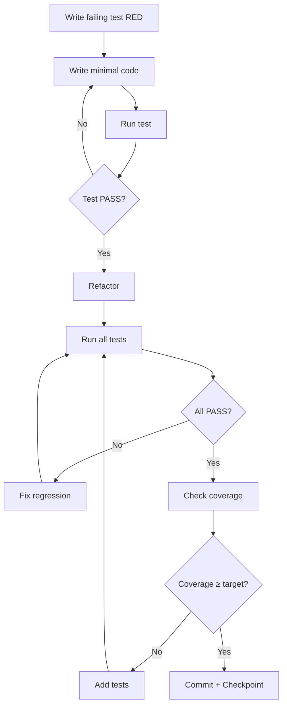

# Testing Requirements — OpticsERP

> **Назначение:** Явные требования по тестированию для каждого компонента
> **Версия:** 1.0 • Дата: 2025-10-08
> **Принцип:** Каждая задача = Код + Тесты (100% coverage критичных путей)

---

## 🎯 Общие принципы тестирования

### Test-Driven Development (TDD)

**Порядок разработки:**
1. ✅ Написать тесты (RED)
2. ✅ Написать минимальный код для прохождения (GREEN)
3. ✅ Рефакторинг (REFACTOR)
4. ✅ Commit с checkpoint reference

**Запрещено:**
❌ Писать код без тестов
❌ Коммитить если тесты не проходят
❌ Пропускать checkpoints

---

## 📊 Уровни тестирования

| Уровень | Что тестирует | Инструменты | Coverage цель |
|---------|---------------|-------------|---------------|
| **Unit** | Отдельные функции/методы | pytest | ≥80% |
| **Integration** | Взаимодействие компонентов | pytest + TestClient | ≥70% |
| **POC** | Proof of Concept scenarios | pytest + docker | 100% POC критериев |
| **UAT** | User Acceptance | pytest + Odoo | ≥95% сценариев |
| **Load** | Производительность | locust | P95≤7s |

---

## Phase 1: POC — Testing Requirements

### Week 1: Базовая инфраструктура

#### Task 1-2: Hybrid Logical Clock

**Код:**
- `kkt_adapter/app/hlc.py` (~100 строк)

**Тесты (ОБЯЗАТЕЛЬНО):**
- `tests/unit/test_hlc.py` (~150 строк)

**Минимальные тестовые сценарии:**
```python
def test_hlc_generation():
    """HLC генерирует timestamp с корректными полями"""
    hlc = generate_hlc()
    assert hlc.local_time > 0
    assert hlc.logical_counter >= 0
    assert hlc.server_time is None  # До синхронизации

def test_hlc_monotonic():
    """HLC монотонно возрастает"""
    hlc1 = generate_hlc()
    time.sleep(0.001)
    hlc2 = generate_hlc()
    assert hlc2 > hlc1

def test_hlc_same_second_increments_counter():
    """Если в ту же секунду — counter инкрементится"""
    # Mock time.time() to return same value
    with patch('time.time', return_value=1234567890):
        hlc1 = generate_hlc()
        hlc2 = generate_hlc()
        assert hlc1.local_time == hlc2.local_time
        assert hlc2.logical_counter == hlc1.logical_counter + 1

def test_hlc_ordering():
    """Сравнение HLC работает корректно"""
    hlc1 = HybridTimestamp(local_time=100, logical_counter=0, server_time=None)
    hlc2 = HybridTimestamp(local_time=100, logical_counter=1, server_time=None)
    hlc3 = HybridTimestamp(local_time=101, logical_counter=0, server_time=None)
    hlc4 = HybridTimestamp(local_time=100, logical_counter=0, server_time=200)

    assert hlc2 > hlc1  # Same time, higher counter
    assert hlc3 > hlc2  # Higher time
    assert hlc4 > hlc3  # Server time wins

def test_hlc_thread_safe():
    """HLC работает корректно при конкурентных вызовах"""
    import threading
    results = []

    def generate_many():
        for _ in range(100):
            results.append(generate_hlc())

    threads = [threading.Thread(target=generate_many) for _ in range(10)]
    for t in threads:
        t.start()
    for t in threads:
        t.join()

    # Check all timestamps are unique and monotonic
    sorted_results = sorted(results)
    assert sorted_results == results  # Should be sorted already
    assert len(set(results)) == len(results)  # All unique
```

**Coverage требования:**
- ✅ 100% функций покрыто
- ✅ 100% веток (if/else) покрыто
- ✅ Edge cases: same second, thread safety

**Checkpoint W1.1:**
```bash
pytest tests/unit/test_hlc.py -v --cov=kkt_adapter.app.hlc --cov-report=term-missing
# Expected:
# - All 5+ tests PASS
# - Coverage ≥90%
```

---

#### Task 3-4: SQLite Buffer CRUD

**Код:**
- `kkt_adapter/app/buffer.py` (~300 строк)

**Тесты (ОБЯЗАТЕЛЬНО):**
- `tests/unit/test_buffer_db.py` (~300 строк)

**Минимальные тестовые сценарии:**
```python
import pytest
import sqlite3
from kkt_adapter.app.buffer import BufferDB

@pytest.fixture
def buffer_db():
    """In-memory SQLite для тестов"""
    db = BufferDB(db_path=':memory:')
    yield db
    db.close()

def test_insert_receipt(buffer_db):
    """Успешное сохранение чека в буфер"""
    receipt_data = {
        'pos_id': 'POS-001',
        'fiscal_doc': '{"items": []}',
        'hlc_local_time': 1234567890,
        'hlc_logical_counter': 0
    }

    receipt_id = buffer_db.insert_receipt(receipt_data)

    assert receipt_id is not None
    assert len(receipt_id) == 36  # UUIDv4

    # Verify in DB
    row = buffer_db.conn.execute(
        "SELECT * FROM receipts WHERE id = ?", (receipt_id,)
    ).fetchone()
    assert row is not None
    assert row['status'] == 'pending'
    assert row['pos_id'] == 'POS-001'

def test_get_pending_receipts(buffer_db):
    """Выборка pending чеков с сортировкой по HLC"""
    # Insert 3 receipts with different HLC
    ids = []
    for i in range(3):
        receipt_id = buffer_db.insert_receipt({
            'pos_id': 'POS-001',
            'fiscal_doc': f'{{"item": {i}}}',
            'hlc_local_time': 1000 + i,
            'hlc_logical_counter': 0
        })
        ids.append(receipt_id)

    pending = buffer_db.get_pending_receipts(limit=10)

    assert len(pending) == 3
    # Should be sorted by HLC
    assert pending[0]['id'] == ids[0]  # Earliest
    assert pending[2]['id'] == ids[2]  # Latest

def test_mark_synced(buffer_db):
    """Обновление статуса на synced"""
    receipt_id = buffer_db.insert_receipt({
        'pos_id': 'POS-001',
        'fiscal_doc': '{}',
        'hlc_local_time': 1000,
        'hlc_logical_counter': 0
    })

    success = buffer_db.mark_synced(receipt_id, server_time=2000)

    assert success is True

    row = buffer_db.conn.execute(
        "SELECT * FROM receipts WHERE id = ?", (receipt_id,)
    ).fetchone()
    assert row['status'] == 'synced'
    assert row['hlc_server_time'] == 2000
    assert row['synced_at'] is not None

def test_move_to_dlq(buffer_db):
    """Перенос чека в Dead Letter Queue"""
    receipt_id = buffer_db.insert_receipt({
        'pos_id': 'POS-001',
        'fiscal_doc': '{}',
        'hlc_local_time': 1000,
        'hlc_logical_counter': 0
    })

    # Simulate 20 retries
    for i in range(20):
        buffer_db.increment_retry(receipt_id, error=f"Error {i}")

    success = buffer_db.move_to_dlq(receipt_id, reason="max_retries_exceeded")

    assert success is True

    # Check DLQ
    dlq_row = buffer_db.conn.execute(
        "SELECT * FROM dlq WHERE original_receipt_id = ?", (receipt_id,)
    ).fetchone()
    assert dlq_row is not None
    assert dlq_row['reason'] == "max_retries_exceeded"

def test_buffer_status(buffer_db):
    """Статистика буфера"""
    # Insert receipts with different statuses
    buffer_db.insert_receipt({'pos_id': 'POS-001', 'fiscal_doc': '{}', 'hlc_local_time': 1000, 'hlc_logical_counter': 0})
    receipt2_id = buffer_db.insert_receipt({'pos_id': 'POS-001', 'fiscal_doc': '{}', 'hlc_local_time': 1001, 'hlc_logical_counter': 0})
    buffer_db.mark_synced(receipt2_id, server_time=2000)

    status = buffer_db.get_buffer_status()

    assert status['total_receipts'] == 2
    assert status['pending'] == 1
    assert status['synced'] == 1
    assert status['percent_full'] > 0

def test_concurrent_inserts(buffer_db):
    """WAL mode позволяет конкурентные вставки"""
    import threading

    def insert_receipts():
        for i in range(10):
            buffer_db.insert_receipt({
                'pos_id': 'POS-001',
                'fiscal_doc': f'{{"i": {i}}}',
                'hlc_local_time': 1000 + i,
                'hlc_logical_counter': 0
            })

    threads = [threading.Thread(target=insert_receipts) for _ in range(5)]
    for t in threads:
        t.start()
    for t in threads:
        t.join()

    # Should have 50 receipts (5 threads × 10 each)
    count = buffer_db.conn.execute("SELECT COUNT(*) FROM receipts").fetchone()[0]
    assert count == 50

def test_hlc_ordering_in_buffer(buffer_db):
    """Сортировка по HLC работает корректно"""
    # Insert with server_time (synced, then re-pending)
    id1 = buffer_db.insert_receipt({'pos_id': 'POS-001', 'fiscal_doc': '{}', 'hlc_local_time': 1000, 'hlc_logical_counter': 0})
    id2 = buffer_db.insert_receipt({'pos_id': 'POS-001', 'fiscal_doc': '{}', 'hlc_local_time': 1000, 'hlc_logical_counter': 1})

    buffer_db.mark_synced(id1, server_time=2000)
    # Reset to pending (simulate error)
    buffer_db.conn.execute("UPDATE receipts SET status='pending' WHERE id=?", (id1,))

    pending = buffer_db.get_pending_receipts(limit=10)

    # id2 should come first (lower logical_counter, no server_time)
    # Actually no, id1 has server_time so it should be first
    # Test HLC ordering logic
```

**Coverage требования:**
- ✅ 100% методов BufferDB покрыто
- ✅ Edge cases: concurrent inserts, DLQ, HLC ordering
- ✅ Error handling: SQLite errors, connection issues

**Checkpoint W1.2:**
```bash
pytest tests/unit/test_buffer_db.py -v --cov=kkt_adapter.app.buffer --cov-report=term-missing
# Expected:
# - All 8+ tests PASS
# - Coverage ≥85%
```

---

### Week 2: FastAPI Skeleton

#### Task 5-8: FastAPI Basic Structure + Endpoints

**Код:**
- `kkt_adapter/app/main.py` (~150 строк)
- `kkt_adapter/app/models.py` (~200 строк)

**Тесты (ОБЯЗАТЕЛЬНО):**
- `tests/integration/test_api_basic.py` (~200 строк)

**Минимальные тестовые сценарии:**
```python
from fastapi.testclient import TestClient
from kkt_adapter.app.main import app

client = TestClient(app)

def test_health_endpoint():
    """GET /health возвращает статус здоровья"""
    response = client.get("/health")

    assert response.status_code == 200
    data = response.json()
    assert data['status'] in ['healthy', 'degraded', 'unhealthy']
    assert 'components' in data
    assert 'sqlite' in data['components']
    assert 'disk_space' in data['components']

def test_health_sqlite_connection():
    """Health check проверяет SQLite connection"""
    response = client.get("/health")
    data = response.json()

    assert data['components']['sqlite']['status'] == 'healthy'

def test_buffer_status_endpoint():
    """GET /v1/kkt/buffer/status возвращает статус буфера"""
    response = client.get("/v1/kkt/buffer/status")

    assert response.status_code == 200
    data = response.json()
    assert 'total_capacity' in data
    assert 'current_queued' in data
    assert 'percent_full' in data
    assert data['total_capacity'] == 200  # From config

def test_buffer_status_percent_calculation():
    """Percent_full рассчитывается правильно"""
    # Insert some receipts
    # ... (use buffer_db fixture)

    response = client.get("/v1/kkt/buffer/status")
    data = response.json()

    expected_percent = (data['current_queued'] / data['total_capacity']) * 100
    assert abs(data['percent_full'] - expected_percent) < 0.01

def test_cors_enabled():
    """CORS headers присутствуют"""
    response = client.options("/health")

    assert 'access-control-allow-origin' in response.headers

def test_exception_handler():
    """Exception handler отлавливает ошибки"""
    # Trigger some error (invalid endpoint)
    response = client.get("/nonexistent")

    assert response.status_code == 404
    data = response.json()
    assert 'detail' in data
```

**Coverage требования:**
- ✅ Все endpoints протестированы
- ✅ Pydantic validation проверена
- ✅ Exception handlers работают

**Checkpoint W2.1:**
```bash
pytest tests/integration/test_api_basic.py -v --cov=kkt_adapter.app.main
# Expected: All 6+ tests PASS
```

---

#### Task 9-10: Receipt Endpoint (Phase 1)

**Код:**
- Обновление `kkt_adapter/app/main.py` (+50 строк)

**Тесты (ОБЯЗАТЕЛЬНО):**
- `tests/integration/test_receipt_endpoint.py` (~200 строк)

**Минимальные тестовые сценарии:**
```python
import uuid
from fastapi.testclient import TestClient
from kkt_adapter.app.main import app

client = TestClient(app)

def test_create_receipt_success():
    """Успешное создание чека"""
    response = client.post(
        "/v1/kkt/receipt",
        headers={"Idempotency-Key": str(uuid.uuid4())},
        json={
            "pos_id": "POS-001",
            "type": "sale",
            "items": [
                {"product_id": "PROD-001", "qty": 1, "price": 1000}
            ],
            "payments": [
                {"method": "card", "amount": 1000}
            ]
        }
    )

    assert response.status_code == 200
    data = response.json()
    assert data['status'] == 'buffered'
    assert 'receipt_id' in data
    assert len(data['receipt_id']) == 36  # UUIDv4

def test_idempotency_key_required():
    """Idempotency-Key обязателен"""
    response = client.post(
        "/v1/kkt/receipt",
        json={
            "pos_id": "POS-001",
            "type": "sale",
            "items": [],
            "payments": []
        }
    )

    assert response.status_code == 400
    assert 'Idempotency-Key' in response.json()['detail']

def test_duplicate_idempotency_key():
    """Дубликат Idempotency-Key возвращает 409"""
    key = str(uuid.uuid4())
    payload = {
        "pos_id": "POS-001",
        "type": "sale",
        "items": [{"product_id": "PROD-001", "qty": 1, "price": 1000}],
        "payments": [{"method": "card", "amount": 1000}]
    }

    # First request
    response1 = client.post(
        "/v1/kkt/receipt",
        headers={"Idempotency-Key": key},
        json=payload
    )
    assert response1.status_code == 200
    receipt_id1 = response1.json()['receipt_id']

    # Second request with same key
    response2 = client.post(
        "/v1/kkt/receipt",
        headers={"Idempotency-Key": key},
        json=payload
    )
    assert response2.status_code == 409
    # Should return same receipt_id
    assert response2.json()['receipt_id'] == receipt_id1

def test_invalid_receipt_data():
    """Невалидные данные возвращают 422"""
    response = client.post(
        "/v1/kkt/receipt",
        headers={"Idempotency-Key": str(uuid.uuid4())},
        json={
            "pos_id": "POS-001",
            "type": "invalid_type",  # Invalid
            "items": [],
            "payments": []
        }
    )

    assert response.status_code == 422

def test_receipt_saved_to_buffer():
    """Чек сохраняется в SQLite буфер"""
    from kkt_adapter.app.main import buffer_db

    initial_count = buffer_db.conn.execute("SELECT COUNT(*) FROM receipts").fetchone()[0]

    response = client.post(
        "/v1/kkt/receipt",
        headers={"Idempotency-Key": str(uuid.uuid4())},
        json={
            "pos_id": "POS-001",
            "type": "sale",
            "items": [{"product_id": "PROD-001", "qty": 1, "price": 1000}],
            "payments": [{"method": "card", "amount": 1000}]
        }
    )

    assert response.status_code == 200

    new_count = buffer_db.conn.execute("SELECT COUNT(*) FROM receipts").fetchone()[0]
    assert new_count == initial_count + 1

def test_hlc_timestamp_assigned():
    """HLC timestamp присваивается чеку"""
    from kkt_adapter.app.main import buffer_db

    response = client.post(
        "/v1/kkt/receipt",
        headers={"Idempotency-Key": str(uuid.uuid4())},
        json={
            "pos_id": "POS-001",
            "type": "sale",
            "items": [{"product_id": "PROD-001", "qty": 1, "price": 1000}],
            "payments": [{"method": "card", "amount": 1000}]
        }
    )

    receipt_id = response.json()['receipt_id']

    row = buffer_db.conn.execute(
        "SELECT * FROM receipts WHERE id = ?", (receipt_id,)
    ).fetchone()

    assert row['hlc_local_time'] > 0
    assert row['hlc_logical_counter'] >= 0
```

**Coverage требования:**
- ✅ All request/response scenarios
- ✅ Idempotency logic
- ✅ Pydantic validation errors
- ✅ Buffer integration

**Checkpoint W2.2:**
```bash
pytest tests/integration/test_receipt_endpoint.py -v
# Expected: All 6+ tests PASS
```

---

### Week 3: Circuit Breaker + Two-Phase

#### Task 11-13: Circuit Breaker

**Код:**
- `kkt_adapter/app/ofd_client.py` (~200 строк)
- `tests/mocks/ofd_mock.py` (~100 строк)

**Тесты (ОБЯЗАТЕЛЬНО):**
- `tests/unit/test_circuit_breaker.py` (~250 строк)

**Минимальные тестовые сценарии:**
```python
import pytest
from kkt_adapter.app.ofd_client import OFDClient
from tests.mocks.ofd_mock import OFDMockServer

@pytest.fixture
def ofd_mock():
    """Mock ОФД сервер"""
    server = OFDMockServer()
    server.start()
    yield server
    server.stop()

def test_cb_closed_normal(ofd_mock):
    """В CLOSED state запросы проходят"""
    client = OFDClient(base_url=ofd_mock.url)

    response = client.send_receipt({"fiscal_doc": "test"})

    assert response.status_code == 200
    assert client.circuit_breaker.current_state == "CLOSED"

def test_cb_opens_after_5_failures(ofd_mock):
    """CB открывается после 5 consecutive failures"""
    ofd_mock.set_mode("error")  # Return 503
    client = OFDClient(base_url=ofd_mock.url)

    # Send 5 failing requests
    for i in range(5):
        with pytest.raises(Exception):
            client.send_receipt({"fiscal_doc": "test"})

    assert client.circuit_breaker.current_state == "OPEN"

def test_cb_open_blocks_requests(ofd_mock):
    """В OPEN state запросы блокируются"""
    ofd_mock.set_mode("error")
    client = OFDClient(base_url=ofd_mock.url)

    # Trigger OPEN
    for i in range(5):
        with pytest.raises(Exception):
            client.send_receipt({"fiscal_doc": "test"})

    # Now blocked
    from pybreaker import CircuitBreakerError
    with pytest.raises(CircuitBreakerError):
        client.send_receipt({"fiscal_doc": "test"})

def test_cb_half_open_after_timeout(ofd_mock):
    """CB переходит в HALF_OPEN через recovery_timeout"""
    import time

    ofd_mock.set_mode("error")
    client = OFDClient(base_url=ofd_mock.url, recovery_timeout=1)  # 1s for test

    # Trigger OPEN
    for i in range(5):
        with pytest.raises(Exception):
            client.send_receipt({"fiscal_doc": "test"})

    assert client.circuit_breaker.current_state == "OPEN"

    # Wait for recovery timeout
    time.sleep(1.5)

    # Restore ОФД
    ofd_mock.set_mode("success")

    # Next request should succeed (HALF_OPEN probe)
    response = client.send_receipt({"fiscal_doc": "test"})
    assert response.status_code == 200

def test_cb_closes_after_successes(ofd_mock):
    """CB закрывается после success_threshold successes"""
    ofd_mock.set_mode("error")
    client = OFDClient(base_url=ofd_mock.url, recovery_timeout=1, success_threshold=2)

    # Trigger OPEN
    for i in range(5):
        with pytest.raises(Exception):
            client.send_receipt({"fiscal_doc": "test"})

    time.sleep(1.5)
    ofd_mock.set_mode("success")

    # Send 2 successful requests (success_threshold)
    for i in range(2):
        client.send_receipt({"fiscal_doc": "test"})

    assert client.circuit_breaker.current_state == "CLOSED"

def test_cb_metrics(ofd_mock):
    """Prometheus метрики обновляются"""
    from prometheus_client import REGISTRY

    ofd_mock.set_mode("error")
    client = OFDClient(base_url=ofd_mock.url, pos_id="POS-001")

    # Trigger OPEN
    for i in range(5):
        with pytest.raises(Exception):
            client.send_receipt({"fiscal_doc": "test"})

    # Check metrics
    metrics = {m.name: m for m in REGISTRY.collect()}

    cb_state = metrics['kkt_circuit_breaker_state']
    assert cb_state._metrics[('POS-001',)]._value._value == 1  # OPEN

    cb_opens = metrics['kkt_circuit_breaker_opens_total']
    assert cb_opens._metrics[('POS-001',)]._value._value == 1
```

**Coverage требования:**
- ✅ All CB states (CLOSED/OPEN/HALF_OPEN)
- ✅ State transitions
- ✅ Metrics updates
- ✅ Callbacks (on_open, on_close)

**Checkpoint W3.1:**
```bash
pytest tests/unit/test_circuit_breaker.py -v --cov=kkt_adapter.app.ofd_client
# Expected: All 6+ tests PASS, coverage ≥80%
```

---

## 📝 Шаблон для каждой задачи

**Для каждой задачи ОБЯЗАТЕЛЬНО:**

### 1. Код Implementation
```markdown
**Файлы:**
- path/to/file.py (~X строк)

**Функциональность:**
- Feature A
- Feature B
```

### 2. Тесты (ВСЕГДА ОБЯЗАТЕЛЬНЫ)
```markdown
**Тестовые файлы:**
- tests/[unit|integration|poc]/test_*.py (~Y строк)

**Минимальные сценарии:**
- test_happy_path() — основной сценарий
- test_edge_case_1() — граничный случай 1
- test_error_handling() — обработка ошибок
- test_validation() — валидация входных данных

**Coverage цель:** ≥80% (unit), ≥70% (integration)
```

### 3. Checkpoint
```markdown
**Checkpoint WX.Y:**
```bash
pytest tests/.../test_*.py -v --cov=module --cov-report=term-missing
# Expected:
# - All N+ tests PASS
# - Coverage ≥Z%
# - No regressions
```
```

### 4. Acceptance Criteria
```markdown
**Acceptance Criteria:**
- ✅ Criterion 1 (measurable)
- ✅ Criterion 2 (testable)
- ✅ Tests pass
- ✅ Coverage met
```

---

## 🚫 Определение Done (DoD)

**Задача НЕ считается выполненной если:**

❌ Нет тестов
❌ Тесты не проходят
❌ Coverage < target
❌ Есть regressions (ранее проходящие тесты failed)
❌ Linter errors
❌ Нет checkpoint verification

**Задача считается Done только если:**

✅ Код написан
✅ Тесты написаны
✅ Все тесты PASS
✅ Coverage ≥ target
✅ No regressions
✅ Checkpoint verified
✅ Committed с checkpoint reference

---

## 📊 Coverage Targets по модулям

| Модуль | Target | Критичность |
|--------|--------|-------------|
| `hlc.py` | ≥90% | HIGH (критичная логика) |
| `buffer.py` | ≥85% | HIGH (durability) |
| `ofd_client.py` | ≥80% | HIGH (Circuit Breaker) |
| `fiscal.py` | ≥85% | HIGH (two-phase) |
| `sync_worker.py` | ≥80% | HIGH (distributed lock) |
| `main.py` (FastAPI) | ≥70% | MEDIUM (mostly routing) |
| `models.py` (Pydantic) | ≥60% | LOW (validation auto) |

---

## 🔄 Test Execution Flow



---

## 🎯 Следующие шаги

1. **Обновить PROJECT_PHASES.md:**
   - Добавить тестовые требования к каждой задаче
   - Добавить coverage targets
   - Обновить checkpoints с coverage

2. **Создать pytest fixtures:**
   - `conftest.py` с общими fixtures
   - Buffer DB fixture (in-memory)
   - FastAPI TestClient fixture
   - Mock servers (OFD, Odoo)

3. **Настроить pytest.ini:**
   - Coverage settings
   - Test markers
   - Параллельное выполнение

---

**Создано:** 2025-10-08
**Обновляется:** При каждом изменении требований
**Принцип:** No code without tests. No tests without assertions.
