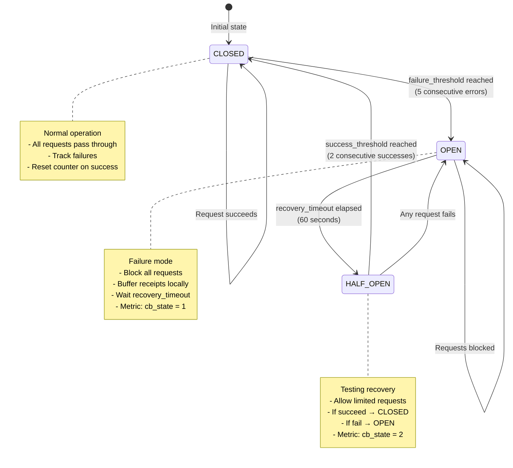
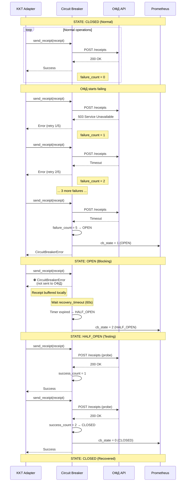

# Circuit Breaker State Transitions

> **Purpose:** Visual representation of Circuit Breaker pattern for ОФД connectivity
> **Reference:** CLAUDE.md §4.2, GLOSSARY.md

---

## State Machine Diagram



---

## Configuration

**From:** `config.toml` or environment variables

```toml
[buffer.circuit_breaker]
failure_threshold = 5         # Errors to trigger OPEN
recovery_timeout = 60         # Seconds in OPEN before HALF_OPEN
success_threshold = 2         # Successes to return to CLOSED
expected_exceptions = [
    "TimeoutError",
    "ConnectionError",
    "HTTPError[5xx]"
]
```

---

## Sequence: Normal → Failure → Recovery



---

## Prometheus Metrics & Alerts

### Metrics

```prometheus
# Circuit Breaker state
kkt_circuit_breaker_state{pos_id="POS-001"}
# Values: 0 (CLOSED), 1 (OPEN), 2 (HALF_OPEN)

# Total times opened
kkt_circuit_breaker_opens_total{pos_id="POS-001"}

# Failure count (current)
kkt_circuit_breaker_failures{pos_id="POS-001"}
```

### Alert Rules

```yaml
groups:
  - name: circuit_breaker_alerts
    rules:
      - alert: CircuitBreakerOpen
        expr: kkt_circuit_breaker_state == 1
        for: 5m
        labels:
          severity: P2
        annotations:
          summary: "Circuit Breaker OPEN на {{ $labels.pos_id }}"
          description: "ОФД недоступен, чеки буферизуются локально"

      - alert: CircuitBreakerFlapping
        expr: increase(kkt_circuit_breaker_opens_total[1h]) > 5
        labels:
          severity: P1
        annotations:
          summary: "Circuit Breaker flapping на {{ $labels.pos_id }}"
          description: "CB открывался 5+ раз за час, возможна сетевая проблема"
```

---

## Grafana Dashboard Panel

```json
{
  "title": "Circuit Breaker States",
  "targets": [
    {
      "expr": "kkt_circuit_breaker_state",
      "legendFormat": "{{ pos_id }}"
    }
  ],
  "fieldConfig": {
    "overrides": [
      {
        "matcher": { "id": "byValue", "options": { "value": 0 } },
        "properties": [{ "id": "color", "value": "green" }]
      },
      {
        "matcher": { "id": "byValue", "options": { "value": 1 } },
        "properties": [{ "id": "color", "value": "red" }]
      },
      {
        "matcher": { "id": "byValue", "options": { "value": 2 } },
        "properties": [{ "id": "color", "value": "yellow" }]
      }
    ]
  }
}
```

---

## Python Implementation (pybreaker)

```python
from pybreaker import CircuitBreaker
from prometheus_client import Gauge, Counter

# Metrics
cb_state = Gauge('kkt_circuit_breaker_state', 'CB state', ['pos_id'])
cb_opens = Counter('kkt_circuit_breaker_opens_total', 'CB opens', ['pos_id'])

def on_open(breaker):
    """Callback when CB opens"""
    pos_id = breaker.name
    cb_state.labels(pos_id=pos_id).set(1)
    cb_opens.labels(pos_id=pos_id).inc()
    logger.warning(f"Circuit Breaker OPEN: {pos_id}")

def on_close(breaker):
    """Callback when CB closes"""
    pos_id = breaker.name
    cb_state.labels(pos_id=pos_id).set(0)
    logger.info(f"Circuit Breaker CLOSED: {pos_id}")

def on_half_open(breaker):
    """Callback when CB enters HALF_OPEN"""
    pos_id = breaker.name
    cb_state.labels(pos_id=pos_id).set(2)
    logger.info(f"Circuit Breaker HALF_OPEN: {pos_id}")

# Create Circuit Breaker
ofd_cb = CircuitBreaker(
    fail_max=5,                    # failure_threshold
    reset_timeout=60,              # recovery_timeout
    expected_exception=(TimeoutError, ConnectionError),
    listeners=[on_open, on_close, on_half_open]
)

# Usage
@ofd_cb
async def send_receipt_to_ofd(receipt):
    """Send receipt to ОФД (protected by CB)"""
    response = await ofd_client.post("/receipts", json=receipt, timeout=10)
    return response
```

---

## Decision Tree: When Circuit Opens

```
Circuit Breaker opened
    ├─→ Is this expected? (e.g., scheduled ОФД maintenance)
    │   ├─→ Yes: Monitor, no action needed
    │   └─→ No: Investigate
    │
    ├─→ Check ОФД status (web portal, support)
    │   ├─→ ОФД down: Wait for recovery, monitor buffer
    │   └─→ ОФД up: Check network connectivity
    │
    ├─→ Check network (ping, traceroute)
    │   ├─→ Network issue: Fix network, CB will recover
    │   └─→ Network OK: Check adapter logs
    │
    └─→ Check adapter logs for errors
        ├─→ API changed: Update ofd_client.py
        ├─→ Auth failed: Renew credentials
        └─→ Unknown: Escalate to L2
```

---

**Reference:**
- CLAUDE.md §4.2 for detailed implementation
- GLOSSARY.md for Circuit Breaker definition
- docs/5 Руководство по офлайн-режиму.md §5.6
