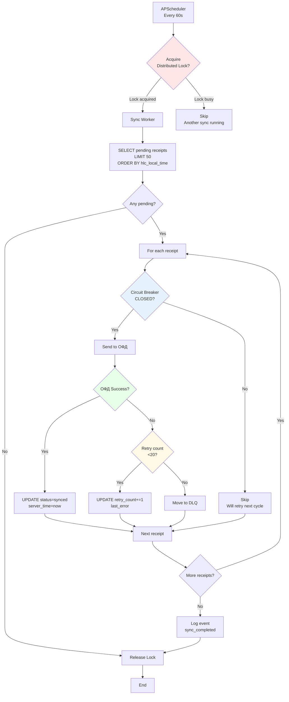
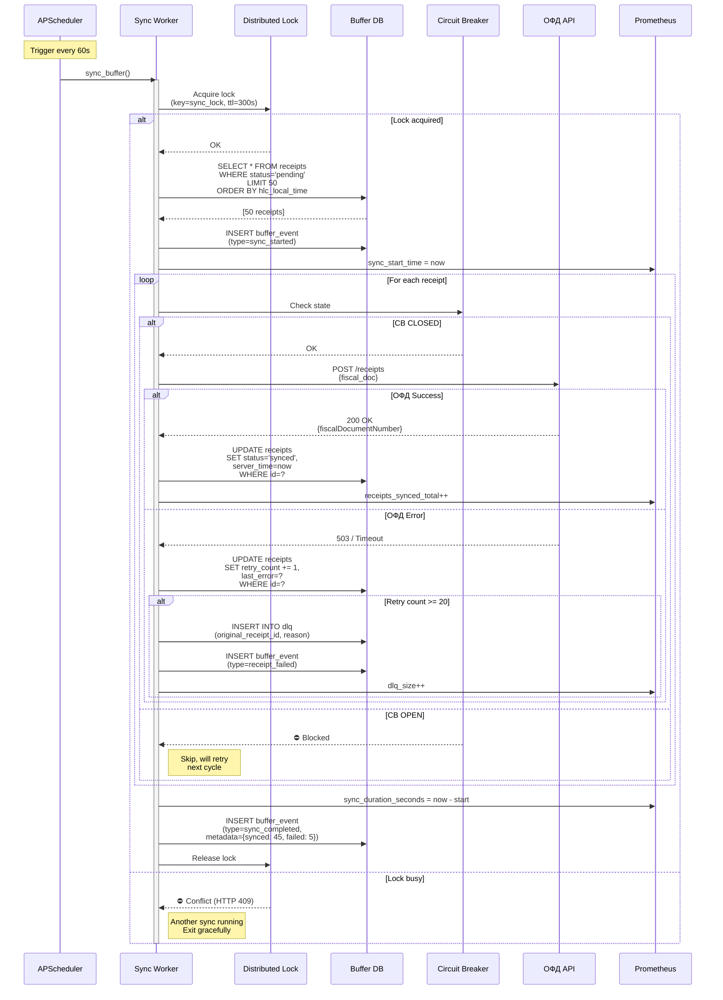

# Offline Buffer Synchronization

> **Purpose:** Visual representation of sync worker process
> **Reference:** CLAUDE.md §4.4, docs/5 §5.4

---

## Sync Worker Architecture



---

## Sync Worker Sequence Diagram



---

## Distributed Lock (Redis)

### Purpose
Prevent concurrent sync workers from duplicating ОФД submissions.

### Implementation

```python
from redis import Redis
from redis.lock import Lock

redis_client = Redis(host='redis', port=6379, decode_responses=True)

async def sync_buffer():
    """Sync pending receipts with ОФД"""
    lock = Lock(
        redis_client,
        'sync_lock',
        timeout=300,     # 5 min TTL (auto-release if worker crashes)
        blocking=False   # Non-blocking (return immediately if busy)
    )

    if not lock.acquire(blocking=False):
        logger.warning("Sync already running (lock not acquired)")
        return {"status": "skipped", "reason": "concurrent_sync"}

    try:
        # Sync logic
        pending = buffer_db.get_pending_receipts(limit=50)
        synced_count = 0
        failed_count = 0

        for receipt in pending:
            if circuit_breaker.current_state == "OPEN":
                break  # Stop if CB opened during sync

            try:
                await ofd_client.send_receipt(receipt)
                buffer_db.mark_synced(receipt['id'], server_time=time.time())
                synced_count += 1
            except Exception as e:
                buffer_db.increment_retry(receipt['id'], error=str(e))
                failed_count += 1

                if receipt['retry_count'] + 1 >= 20:
                    buffer_db.move_to_dlq(receipt['id'], reason="max_retries")

        return {"status": "completed", "synced": synced_count, "failed": failed_count}

    finally:
        lock.release()
```

---

## APScheduler Configuration

```python
from apscheduler.schedulers.asyncio import AsyncIOScheduler

scheduler = AsyncIOScheduler()

# Sync worker: every 60 seconds
scheduler.add_job(
    sync_buffer,
    'interval',
    seconds=60,
    id='sync_worker',
    replace_existing=True,
    max_instances=1  # Prevent concurrent runs (belt-and-suspenders with Redis lock)
)

# Start scheduler
scheduler.start()
```

---

## Metrics & Monitoring

### Prometheus Metrics

```python
from prometheus_client import Counter, Histogram, Gauge

# Sync duration
sync_duration = Histogram(
    'kkt_sync_duration_seconds',
    'Sync worker duration',
    ['pos_id'],
    buckets=[0.1, 0.5, 1, 2, 5, 10, 30, 60]
)

# Receipts synced
receipts_synced = Counter(
    'kkt_receipts_synced_total',
    'Total receipts synced',
    ['pos_id', 'status']  # status: success|failed
)

# Buffer size
buffer_size = Gauge(
    'kkt_buffer_size',
    'Current pending receipts',
    ['pos_id']
)

# DLQ size
dlq_size = Gauge(
    'kkt_dlq_size',
    'Dead Letter Queue size',
    ['pos_id']
)
```

### Alert Rules

```yaml
groups:
  - name: sync_alerts
    rules:
      - alert: SyncWorkerSlow
        expr: kkt_sync_duration_seconds{quantile="0.95"} > 600
        for: 10m
        labels:
          severity: P2
        annotations:
          summary: "Sync worker медленный на {{ $labels.pos_id }}"
          description: "P95 sync duration > 10 мин"

      - alert: BufferGrowing
        expr: increase(kkt_buffer_size[30m]) > 20
        labels:
          severity: P2
        annotations:
          summary: "Буфер растёт на {{ $labels.pos_id }}"
          description: "Буфер вырос на 20+ чеков за 30 мин, проверить ОФД"

      - alert: DLQNotEmpty
        expr: kkt_dlq_size > 0
        for: 1h
        labels:
          severity: P3
        annotations:
          summary: "DLQ не пуст на {{ $labels.pos_id }}"
          description: "{{ $value }} чеков требуют ручной обработки"
```

---

## Exponential Backoff Strategy

```python
import asyncio
from tenacity import retry, stop_after_attempt, wait_exponential

@retry(
    stop=stop_after_attempt(20),
    wait=wait_exponential(multiplier=1, min=1, max=60),
    reraise=True
)
async def send_receipt_with_backoff(receipt):
    """
    Retry with exponential backoff:
    - Attempt 1: wait 1s
    - Attempt 2: wait 2s
    - Attempt 3: wait 4s
    - ...
    - Attempt 7+: wait 60s (max)
    - Attempt 20: fail → DLQ
    """
    response = await ofd_client.post("/receipts", json=receipt, timeout=10)
    return response
```

**Backoff timeline:**
```
Attempt  Wait (s)  Cumulative (s)
1        0         0
2        1         1
3        2         3
4        4         7
5        8         15
6        16        31
7        32        63
8        60        123  (capped at max=60)
...
20       60        ~18 minutes total
```

---

## Edge Cases Handling

### Case 1: Sync worker crashes mid-sync

```
Problem: Lock held, worker dead
Solution: Redis lock TTL (300s) auto-releases
Result: Next sync cycle acquires lock and continues
```

### Case 2: Circuit Breaker opens during sync

```
Problem: ОФД fails mid-batch (e.g., synced 20/50)
Solution: Worker stops immediately, remaining 30 stay pending
Result: Next cycle retries remaining receipts
```

### Case 3: SQLite locked (rare with WAL)

```
Problem: Long-running read query locks writes
Solution: WAL mode allows concurrent reads/writes
Fallback: Retry INSERT with 100ms timeout
```

### Case 4: Partial sync (some succeed, some fail)

```
Problem: 45/50 synced, 5 failed
Solution: Each receipt tracked independently (status field)
Result: Next cycle retries only 5 failed receipts
```

---

## Grafana Dashboard Query Examples

### Sync throughput (receipts/min)
```promql
rate(kkt_receipts_synced_total{status="success"}[5m]) * 60
```

### Buffer backlog (hours to clear)
```promql
kkt_buffer_size / (rate(kkt_receipts_synced_total{status="success"}[5m]) * 60)
```

### Sync success rate (%)
```promql
sum(rate(kkt_receipts_synced_total{status="success"}[5m]))
  / sum(rate(kkt_receipts_synced_total[5m])) * 100
```

---

**Reference:**
- CLAUDE.md §4.4 for detailed implementation
- docs/5 Руководство по офлайн-режиму.md §5.4
- GLOSSARY.md for Distributed Lock, DLQ definitions
