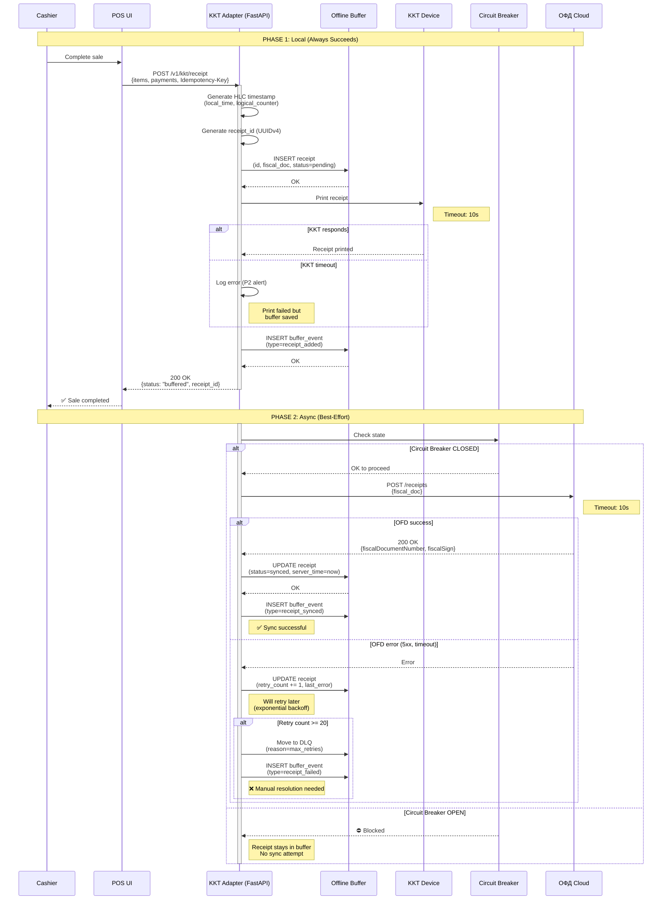

# Two-Phase Fiscalization — Sequence Diagram

> **Purpose:** Visual representation of двухфазная фискализация process
> **Reference:** CLAUDE.md §4.2, docs/5 §5.3

---

## Process Flow



---

## Key Points

### Phase 1 (Local)
- **Always succeeds** even if ОФД unavailable
- Receipt saved to SQLite with WAL+FULL synchronous
- Printed on KKT (best-effort, 10s timeout)
- Cashier can continue selling immediately

### Phase 2 (Async)
- **Best-effort** delivery to ОФД
- Circuit Breaker prevents hammering failing ОФД
- Exponential backoff for retries (up to 20 attempts)
- After max retries → Dead Letter Queue (manual resolution)

---

## Critical Distinction

| Aspect | Phase 1 | Phase 2 |
|--------|---------|---------|
| **Timing** | Synchronous (blocking) | Asynchronous (background) |
| **Failure handling** | Never fails | Retries + DLQ |
| **Business impact** | Blocks sale if fails | No impact on sales |
| **Бизнес-доступность** | Critical | Non-critical |

---

## Error Scenarios

### Scenario 1: ОФД Unavailable

```
Phase 1: ✅ Receipt saved + printed → Cashier happy
Phase 2: ⛔ Circuit Breaker OPEN → Receipt buffered
Result: Business continues, sync when ОФД returns
```

### Scenario 2: KKT Timeout

```
Phase 1: ✅ Receipt saved, ⚠️ Print timeout → P2 alert
Phase 2: ✅ Synced to ОФД (when back online)
Result: Customer doesn't get paper receipt, but fiscal data preserved
```

### Scenario 3: Power Loss During Phase 1

```
Phase 1: ✅ SQLite WAL ensures durability → Receipt recovered after reboot
Phase 2: ✅ Sync worker picks up on restart
Result: Zero data loss (WAL+FULL synchronous)
```

---

## Prometheus Metrics

```prometheus
# Buffer size
kkt_buffer_size{pos_id="POS-001"} = 15

# Circuit Breaker state (0=CLOSED, 1=OPEN, 2=HALF_OPEN)
kkt_circuit_breaker_state{pos_id="POS-001"} = 1

# Sync duration (histogram)
kkt_sync_duration_seconds{pos_id="POS-001", quantile="0.95"} = 2.3

# DLQ size
kkt_dlq_size{pos_id="POS-001"} = 2
```

---

**Reference:** See CLAUDE.md §4.2 for implementation details.
